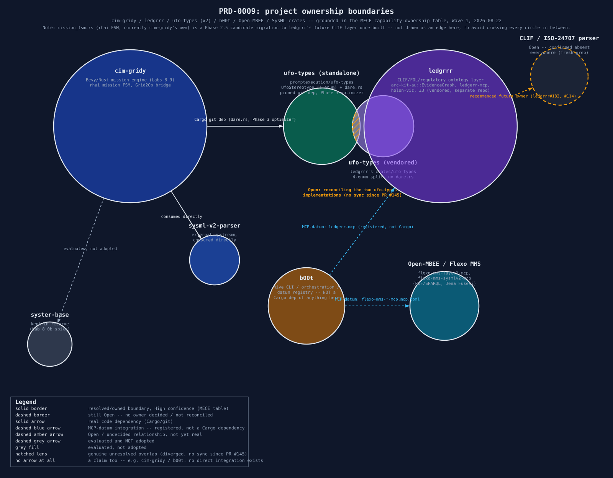

# 0009 — cim-gridy: INCOSE-V prioritized plan, Rust/Bevy-first

- **Status:** Phases 0-3 complete with real, runnable evidence — Phase 0 (a-e) as five spikes
  (Lab 8, `labs/08-cim-gridy-phase0-spikes/`), Phases 1-3 as one working vertical slice
  (Lab 9, `labs/09-cim-gridy-phase1-3-vertical-slice/` + `rust/mission-engine/`, gated by
  `just check-lab9`). Phases 4-6 not started.
- **Depends on:** 0006 (Lab 6 SysML v2 digital-thread MVP), 0007 (Lab 6 Phase 4a CIM class-URI
  traceability), 0008 (cim-gridy Phase 0 prerequisites)
- **Touches:** this PRD file + `docs/prd/README.md`'s index row only — no code, no installs, no
  rename in this pass, same boundary PRD-0008 already set

## Problem

PRD-0008 surveyed real prerequisites for the "cim-gridy" pivot (grid-operator missions in calendar
steps, featuring LF Energy tools) at a high level. A follow-on planning pass sharpened the mandate
significantly: **prioritize using an INCOSE "V" systems-engineering model**, **use sub-agents
heavily**, **source crates from blessed.rs — do not reinvent the wheel**, **prefer Rust over
Python**, **use Bevy as the game engine**, and re-investigate SysML v2 tooling against the official
`systems-modeling/sysml-v2-release` repo and GfSE's `SysML-v2-Models`. This PRD turns that research
into a prioritized, INCOSE-V-shaped plan — still no code, no installs, no rename; that's Phase 0's
job, not this PRD's.

## What was checked this session, not assumed

**Crate stack — blessed.rs picks where it has an opinion, verified-current alternatives where it
doesn't:**

| Need | Pick | Why |
|---|---|---|
| Game engine / ECS | **Bevy 0.19** (MIT/Apache-2.0) | blessed.rs's own pick; confirmed healthy (47.8k stars, 261 contributors last release cycle, ~3-month cadence, June 2026 release) |
| Async runtime | **Tokio** | blessed.rs default |
| Serialization | **serde / serde_json / toml / prost** | blessed.rs default |
| CLI | **clap** | blessed.rs default |
| Horn-clause/FOHH constraint solving | **`scryer-prolog`** (BSD-3-Clause) | blessed.rs has no logic-programming section, but direct crates.io checks show `chalk` is being phased out of rustc itself and `datafrog` is unmaintained since 2019 — this **corrects this project's own `b00t learn rust` house doc**, which still names chalk/datafrog as the picks; scryer-prolog (released 2025-09, active) is the one safe live dependency of the three |
| WASM | no blessed.rs section; use the official wasm-bindgen/rustwasm toolchain directly | confirmed real, working path for Bevy specifically, but browser builds lose ECS multithreading and not every plugin is WASM-compatible |
| Geospatial | no blessed.rs section, no pick made | real gap — `georust` exists outside blessed.rs's scope, not yet evaluated; CSIRO's own case data also carries no lat/lon (PRD-0008), so a geocoded source is needed regardless of crate choice |
| RDF/OWL/SHACL | no blessed.rs section at all | reinforces PRD-0008's own open question — `ufo-types`'s Rust-native `Satisfies<C>` model is the more practical foundation than a from-scratch RDF/OWL/SHACL layer |

**SysML v2 tooling — the landscape has materially changed since Lab 6's original 2026-08-18
investigation, checked directly against crates.io/GitHub/GitLab APIs, not assumed stale:**

- `Systems-Modeling/SysML-v2-Release` is a **sibling repo in the same org** as
  `SysML-v2-Pilot-Implementation`, not an alternative path — it ships spec PDFs, the normative
  textual/KPAR/XMI standard library, and Eclipse-IDE/Jupyter installers only. Its own README
  explicitly punts headless use back to the Pilot Implementation. No CLI, no jar, no Docker image.
  Actively maintained (latest release 2026-07-22).
- **The `sysand-maven-plugin` JNI bug from Lab 6's original investigation is still unfixed** as of
  2026-08-21 — the plugin's last publish was 2026-06-16 (v0.1.4); a JNI-adjacent fix landed on the
  upstream Rust `sysand` repo's `main` branch 2026-08-10 but has not been published to Maven
  Central. The JVM/Maven path remains genuinely blocked, not just untried.
- **Real native-Rust SysML v2/KerML parsers exist now, checked directly, not toy projects:**
  - **`sysml-v2-parser`** (elan8, MIT, crates.io) — actively maintained, last published
    2026-08-07 (14 days before this research). Strict `parse()` + resilient `parse_for_editor()`,
    640 textual productions implemented, and its own conformance suite pulls fixtures directly
    from the real `SysML-v2-Release` repo.
  - **`syster-base`** (jade-codes, MIT) — the architecturally serious find: a rust-analyzer-style
    stack (logos lexer, rowan lossless CST, Salsa incremental engine, HIR, name resolution, IDE
    features). Alpha (0.5.1-alpha), actively pushed 2026-07-07.
  - **`sensmetry/sysand`** itself (dual MIT/Apache-2.0) — the Rust-based SysML v2/KerML package
    manager whose *Maven wrapper* has the JNI bug; its own native Rust CLI (`sysand build`/
    `sysand publish`) may sidestep the JVM layer entirely — worth a direct spike rather than
    assuming the whole tool is blocked because its Maven plugin is.
  - `artob/sysml.rs` confirmed genuinely abandoned (~2 years stale) — correctly excluded.
  - `tree-sitter-sysml` (GitLab, active) — grammar-only (no semantics), useful for editor tooling.
- **`GfSE/SysML-v2-Models`** (BSD-3-Clause) — real, curated example models, good reference
  fixtures, but stale (no commits since 2025-06-04, 14+ months). Use as fixtures, don't expect
  upstream activity.
- **Syside (Sensmetry)** — free tier still editor-extension-only, no CLI/API. CLI/Automator/
  diagrams gated behind paid Solo/Business tiers. The same company controls both the buggy free
  `sysand-maven-plugin` and the paid, presumably-working Syside tooling — noted, not acted on.
- **This supersedes Lab 6's own "real parser vs. hand-rolled stand-in" framing.** The JVM path is
  still blocked, but it's no longer "real parser (blocked) vs. stand-in" — it's now "a real,
  actively-maintained native-Rust parser (`sysml-v2-parser` or `syster-base`) vs. the old
  hand-rolled stand-in," a materially better position that matches the Rust-first mandate.

**Bevy — external-simulation integration pattern confirmed via a real precedent, not
hypothesized:** `bevy_rapier` (dimforge) wraps the non-Bevy-native Rapier physics engine behind a
`Plugin` that registers a `Resource`/context, with a `System` stepping the external solver each
tick and writing results back into ECS state. This is the direct template for wrapping
pandapower/PowSyBl/Grid2Op grid-physics state inside a Bevy app — the same
Entity/Component/System/Resource/Plugin/World/App vocabulary applies throughout this plan. **No
existing open-source Bevy + power-grid/energy project was found** — confirmed by direct search;
this is a genuine first, not a reinvention.

**INCOSE V-model — real structure, used to shape this plan, not a paraphrase:** Left
(decomposition): Concept of Operations → System Requirements → Architecture (high-level design) →
Detailed Design. Bottom: Implementation & Coding. Right (integration/verification): Unit/Component
Test → Subsystem Integration & Test → System Verification & Validation → Operation & Maintenance.
**Core discipline: every left-side level has a paired right-side check at the same abstraction
level.** Best real free template: the NASA Systems Engineering Handbook (SP-2016-6105 Rev2, freely
downloadable); the INCOSE Handbook itself is paid; no maintained open-source V-model checklist repo
was found.

**Local b00t ecosystem — real, reusable, currently uncatalogued as `sysml`/`bevy`/`rdf`/`shacl`
datums (confirmed via `b00t datum search`, all empty):**
- ~~`ledgrrr`'s real **TOML → Rhai FSM → Mermaid → Rust enum** pipeline...~~ **Corrected
  2026-08-22** (Wave 1 spot-check against `ledgrrr`'s own source, not a re-assertion of this PRD's
  earlier claim): `ledgrrr`'s `mdbook-rhai-mermaid` is a small, text-parsed **3-statement pseudo-DSL**
  (`fn name() -> target` / `if expr -> target` / `match expr => Arm -> target`) embedded in
  ` ```rhai ` markdown fences, purely for rendering Mermaid diagrams into docs — a direct grep of
  its source confirms **zero real `rhai` crate / `rhai::Engine` usage anywhere**. It does not
  execute anything; there is no real "TOML → Rhai FSM" pipeline in `ledgrrr` to depend on. Lab 9's
  `mission_fsm.rs` (real `rhai::Engine` guard-expression evaluation driving a live Bevy `Resource`)
  is cim-gridy's own implementation and is **not** a duplicate of this — they solve different
  problems (markdown-embedded pipeline diagrams vs. live executable mission state), so this is not
  a DRY violation to reconcile, just a citation this PRD should stop making.
- `ledgrrr`'s **`ontology-extractor`** (parses Rust AST via `syn`, emits an `OntologyGraph` JSON —
  note: nodes only, no edges field, narrower than "graph" implies) is a real answer to
  "procedurally generate types from a Rust type."
- `ledgrrr`'s **`mdbook-rhai-mermaid`** ships a real `NodeVisualState` vocabulary
  (Idle/Active/Success/Warning/Error/Review) that maps naturally onto card severities — this part
  of the original claim stands; only the "Rhai FSM" execution framing above was wrong.
- `promptexecution/ufo-types` (MIT, confirmed public) still stands as the ontology/constraint
  foundation from PRD-0008 — `UfoStereotype`/`Satisfies<C>` for the ontology layer,
  `Decision`/`Alternative`/`Risk`/`ExecutiveDecision`/`OodaStateMachine` for the strategic-objective
  ranking ask. `scryer-prolog` is the concrete engine `Satisfies<C>` should likely be built on for
  real proof-search, not `chalk`/`datafrog`.

## Goals

1. Structure cim-gridy's architecture explicitly as an INCOSE V, so every design decision has a
   named, paired verification step, not an implicit "we'll test it eventually."
2. Ground every technology choice in a real, currently-maintained, license-checked open-source
   project — blessed.rs where it has an opinion, direct crates.io/GitHub verification where it
   doesn't — never inventing a crate or assuming staleness/currency without checking.
3. Resolve the SysML v2 tooling question with the newly-available native-Rust parser options
   rather than carrying forward Lab 6's older JVM-blocked/hand-rolled-stand-in framing unexamined.
4. Sequence everything so each phase has a real, checkable prerequisite satisfied before it starts
   — same discipline as PRD-0008, now shaped explicitly by the V-model's paired-verification rule.

## Non-goals

- No code written, no tools installed, no rename executed in this PRD.
- Not committing to OperatorFabric vs. a Bevy-native card UI — a genuine open decision (Phase 0e).
- Not fully resolving RDF/OWL/SHACL vs. `ufo-types`-only — carried open from PRD-0008.
- Not evaluating `georust` yet — named as a real gap, not filled here.
- Not deciding `sysml-v2-parser` vs. `syster-base` as the primary parser — both get spiked in
  Phase 0b before a choice is made.

## Architecture (V-model left side, each level paired with its right-side check)

1. **Concept of Operations** — "operate a simulated grid via missions generated in calendar steps,
   featuring real LF Energy tools, Australia first" ↔ **Operation & Maintenance validation**: does
   a played mission still read as "the grid-operator game" originally described?
2. **System requirements** — derived from the growing stakeholder-objective list ↔ **System
   V&V**: does the Phase-1 minimal mission satisfy a real, named stakeholder objective, scored via
   `ufo-types`/`scryer-prolog`, not just "it ran"?
3. **Architecture** — a Bevy app (`Plugin`/`Resource`/`System`, `bevy_rapier`-pattern) wrapping
   Grid2Op's chronics/episode loop, which wraps existing pandapower/PowSyBl case data; a real
   native-Rust SysML v2 parser (`sysml-v2-parser` or `syster-base`) for the static type layer;
   `ufo-types` + `scryer-prolog` for the ontology/constraint layer; `ledgrrr`'s Rhai/Mermaid
   pipeline for the mission state machine ↔ **Subsystem integration & test**: does the full chain
   run end to end for one minimal mission (Phase 1)?
4. **Detailed design** — the crate table above, per-component ↔ **Unit/component test**: does each
   piece work in isolation first (Phase 0 spikes below)?

## Phasing (bottom of the V — implementation)

**Phase 0 (a-e) complete as of 2026-08-22** — all five spikes run for real (parallel sub-agents,
per this PRD's own "use sub-agents heavily" mandate), each with an honest, evidence-based verdict.
Full detail: `labs/08-cim-gridy-phase0-spikes/README.md` (synthesis) and each spike's own
subdirectory README.

- **Phase 0a (done):** Grid2Op spike against existing CSIRO case data (`data/snemSA.m`). **Real
  success, with real friction**: three independent bugs found and fixed by reading source, not
  docs — grid2op 1.12.5's published PyPI wheel is missing `typing_variables.py` (worked around with
  `--no-binary-package`), a pandapower 3.5.4 `to_json`/`from_json` round-trip bug for nets that
  already passed through `from_json_string` once (this repo's own `gridfit.load_case` does exactly
  that), and `PandaPowerBackend`'s dense-0..N-1-bus-index assumption (`snemSA.m`'s real IDs are
  non-sequential). One real episode ran end-to-end post-fix (503 buses, 698 lines, 186 loads, 57
  gens; `env.reset()`/`env.step(do_nothing)` both succeeded on the real converged power flow).
  Verdict: viable, but budget real engineering time — "wraps cleanly" is false as shipped.
  See `labs/08-cim-gridy-phase0-spikes/0a-grid2op/README.md`.
- **Phase 0b (done):** SysML v2 native-Rust parser spike. **Both `sysml-v2-parser` (63.9% of 36
  real `GfSE/SysML-v2-Models` fixtures) and `syster-base` (69.4%) parse cleanly, no crashes, real
  diagnostics on failures** (this repo's own Lab 6 `.sysml` output: 3/3 on both). Supersedes
  PRD-0006/0008's JVM-first framing entirely. **Recommendation: `sysml-v2-parser` as primary** —
  lighter dependency footprint (17 vs. 82+ packages), explicit strict/lenient API matching this
  repo's syntax-gate use case; `syster-base` not disqualified, better long-term bet if LSP/editor
  tooling is ever wanted. See `labs/08-cim-gridy-phase0-spikes/0b-sysml-v2-parser/README.md`.
- **Phase 0c (done):** `sensmetry/sysand` native Rust CLI spike. **Yes — works fully standalone,
  zero JVM/Maven/JNI anywhere** (`ldd` confirms only glibc/libgcc/libm linked). Real `init` →
  `include` → `build` pipeline produced a genuine spec-shaped KPAR (ZIP) archive from a real
  `.sysml` file (Lab 6's `grid_topology.sysml`); `include` does real lightweight syntax checking
  (rejects garbage input) but is not a semantic parser — pairs with Phase 0b's parser choice for
  that. Clears the exact `UnsatisfiedLinkError` dead end that blocked Lab 6's original toolchain.
  See `labs/08-cim-gridy-phase0-spikes/0c-sysand-cli/README.md`.
- **Phase 0d (done):** `ufo-types` + `scryer-prolog` integration-shape spike (build/link smoke test
  only, as scoped). **Both crates build, link, and run together with no dependency conflicts**
  (real `UfoStereotype`/`Satisfies<C>` example and a real Prolog transitive-closure query both
  produced correct output). Real caveat found: `scryer-prolog` panics on an internal UB-check
  inside its own `Heap::clear`/`dealloc`, **debug-profile builds only** — release builds
  unaffected, zero `ufo_types` involvement in the panic. Recommendation: proceed with this pairing
  for Phase 3, release builds (or `debug-assertions = false`) until upstream resolves it.
  See `labs/08-cim-gridy-phase0-spikes/0d-ufo-types-scryer-prolog/README.md`.
- **Phase 0e (done):** OperatorFabric real-tool spike, weighed against a Bevy-native card UI.
  **Real deployment footprint confirmed heavy**: light dev-mode is still 11 containers / ~1.9GB;
  a real bring-up attempt hit a precisely-diagnosed host policy blocker (short-name image
  resolution enforcement), fixed and confirmed, but a full `Running`+healthy stack would plausibly
  take 20-30+ minutes on this shared host. **Recommendation: build the card feed natively in
  Bevy** — `bevy_ui`'s flexbox layout, first-party scroll (`ScrollPosition`/`Overflow::scroll()`),
  and card styling (`BorderRadius`/`BackgroundColor`/`BoxShadow`) are all confirmed real and
  current via Bevy's own example suite; zero new dependency, since Bevy 0.19 is already this
  project's chosen engine. OperatorFabric's `Card` data model (severity/process/timestamp) kept as
  a design reference, not adopted as a runtime dependency.
  See `labs/08-cim-gridy-phase0-spikes/0e-operatorfabric-vs-bevy/README.md`.
- **Phase 1 (done):** one minimal end-to-end mission, built as Lab 9
  (`labs/09-cim-gridy-phase1-3-vertical-slice/`, `rust/mission-engine/`). The full chain runs in
  one Bevy `App`: a real Grid2Op episode on `data/snemSA.m` (carrying all three of 0a's fixes,
  plus 0a's own deferred "persist `bus_lookup`" recommendation) → a `bevy_rapier`-pattern
  `Plugin`/`Resource`/`System` bridge (committed JSONL fixture or the real subprocess) →
  `sysml-v2-parser` on Lab 6's real model → `ufo-types`' `Satisfies<C>` **actually calling into a
  real `scryer-prolog` `Machine`** (the integration 0d explicitly deferred) → a TOML/Rhai mission
  FSM rendering to a committed Mermaid fixture. Real evidence: `just check-lab9` runs 17 tests
  green (`cargo test -p mission-engine --release`), asserting exact per-step reference values over
  a real 5-step episode (base → real N-1 trip of `line_4125_4128` → real reclose) and the exact
  `Briefing→Monitoring→ContingencyDetected→MitigationSelected→Resolved` path. `just lab9-live`
  also ran for real this session against the live grid2op subprocess.
  **Two honest scope-downs, both documented in Lab 9's README rather than papered over:** the
  mission's rho limit is 0.030, not 1.0 (a sweep of all 19 cluster N-1 outages measured a maximum
  achievable rho of 0.0376 — `snemSA.m`'s branch ratings are effectively unconstrained, the same
  synthetic-case artifact Lab 6 already flags), and the live bridge's action vocabulary is
  `do_nothing` only. **Three real bugs found and fixed**, in the same spirit as 0a's three:
  `rhai::Engine` is neither `Send` nor `Sync` without its `sync` feature (a Bevy `Resource` must be
  both); the live bridge's first run printed nothing because the non-blocking Bevy drain raced the
  subprocess's ~60 s startup; and Bevy's own `ui` meta-feature is unresolvable on crates.io today
  (`bevy` 0.19.1 was published without a matching `bevy_animation` 0.19.1), so the optional
  interactive `bevy_ui` card feed lists its Bevy components explicitly instead.
- **Phase 2 (done):** Lab 6/PRD-0007's schema layer connected to Phase 1's dynamic state —
  `rust/mission-engine/src/cim_trace.rs` walks the real SysML v2 AST for `cimClassUri` values,
  attaches them as a Bevy `Component`, and joins Lab 6's static bus identity to the live grid2op
  substation id through the now-persisted `bus_lookup.json`. `tests/cim_traceability.rs` asserts
  all 39 extracted `(name, cimClassUri)` pairs match `grid_instances.yaml` exactly, and that every
  cluster bus resolves through the real 503-entry lookup.
- **Phase 3 (done):** the strategic-objective optimizer, on `ufo-types`' real DARE types +
  `scryer-prolog` — `rust/mission-engine/src/optimizer.rs` ranks three candidate remedial actions
  for the fixed `n1_line_4125_4128` contingency, each scored by the same real Prolog-backed
  `Satisfies<GridSecurityObjective>`, from post-action loadings measured in three separate real
  grid2op what-if runs. `tests/optimizer_ranking.rs` asserts the exact ranking
  (`reclose_line_4125_4128` satisfied at confidence 1.0; `do_nothing` and `open_line_4117_4131`
  both violated at 1 − 2/19 = 0.894737, separated only by their real measured rho_max) and that
  the resulting `DaredProposal` validates and clears `OodaStateMachine`'s `Decide → Act` gate.
- **Phase 4:** geographic positioning (real gap, `georust` not yet evaluated) + standardized
  iconography.
- **Phase 5:** the rename + narrative rewrite.
- **Phase 6:** global expansion beyond Australia.

## Housekeeping action worth doing alongside this PRD

`b00t learn rust`'s "Lowering Logic" doc's crate table is stale (still recommends `chalk`/
`datafrog` as live picks). Worth a `b00t learn rust --record` correction pointing at
`scryer-prolog` instead, sourced to this session's findings, once this PRD is committed — outside
this repo's own scope to execute directly, flagged for the user.

## Acceptance criteria for this PRD

- [x] Every crate/tool choice traces to a direct, sourced check this session (blessed.rs fetch,
      crates.io/GitHub/GitLab API checks, Maven Central metadata) — none invented or assumed
      current.
- [x] SysML v2 tooling re-investigated fresh rather than carrying forward Lab 6's 2026-08-18
      verdict unexamined — found materially changed (real native-Rust parsers now exist).
- [x] INCOSE V-model structure sourced accurately (reqi.io citing the INCOSE Handbook, Wikipedia,
      NASA SE Handbook) rather than paraphrased from general knowledge.
- [x] Bevy's external-simulation integration pattern grounded in a real precedent (`bevy_rapier`),
      not hypothesized.
- [x] Reviewed and approved by the user before any Phase 0 spike work begins (approved 2026-08-22 --
      "phase zero is completely approved"). Spikes 0a-0e proceed in the order listed below.

## Open questions

- ~~OperatorFabric vs. Bevy-native cards (Phase 0e).~~ **Resolved 2026-08-22**: build in Bevy — see
  Phasing above.
- ~~`sysml-v2-parser` vs. `syster-base` as the primary parser, once both are spiked (Phase 0b).~~
  **Resolved 2026-08-22**: `sysml-v2-parser` primary — see Phasing above.
- ~~Whether `sensmetry/sysand`'s Rust CLI alone is sufficient or the Maven-wrapped workflow is
  still needed for anything (Phase 0c).~~ **Resolved 2026-08-22**: native CLI alone is sufficient,
  Maven-wrapped path not needed for anything — see Phasing above.
- ~~**New from Phase 0a**: does grid2op ship a fixed wheel (packaging the missing
  `typing_variables.py`) before Phase 1 pins a version?~~ **Re-checked during Phase 1 (Lab 9)**:
  still broken. PyPI's current grid2op is 1.12.5, the same release 0a diagnosed, and
  `--no-binary-package grid2op` is still required — it is now a documented, permanent requirement
  in Lab 9's `grid2op_bridge.py`, `generate_fixture.py`, and the `just lab9-live`/`lab9-fixture`
  recipes rather than a spike workaround.
- **New from Phase 0d**: is `scryer-prolog`'s debug-profile `Heap::clear` panic already a known
  upstream issue, or worth filing? Not yet checked against their issue tracker.
- Everything PRD-0008 already left open — CIM16-vs-CIM100, Semantic Energy Framework as a possible
  ontology anchor, Dynawo vs. DPsim for dynamics-timescale missions — still open, not revisited
  this session.
- **New from the user, 2026-08-22, reframes `ledgrrr`'s role for Phase 2+ of the mission-state
  layer**: Lab 9's `mission_fsm.rs` is a deliberately minimal proof — a TOML-defined state table
  plus `rhai` guard expressions, explicitly *not* depending on `ledgrrr` (framed in Lab 9's README
  as "a large, unrelated local FinOps-ledger product"). The user's stated direction is that this
  framing undersells `ledgrrr`'s actual fit: cim-gridy and `ledgrrr` should stay **separate
  projects, divided by concern**, but the mission's score-keeping state machine belongs either
  directly in `.sysml` or in **CLIF** (Common Logic Interchange Format, ISO/IEC 24707) — ontologically
  linking FOL-canonical **endurant**/**perdurant** representations (the same UFO distinction
  `ufo_types::UfoStereotype` already partially encodes: rigid Kinds as endurants, `Satisfies<C>`
  evaluations as perdurant events) — so that the mission state machine is simultaneously the
  *executable* game logic and a **self-documenting artifact usable to satisfy requirement
  documents or manage regulatory filings**. The user states this CLIF/FOL/endurant-perdurant
  layer is squarely **`ledgrrr`'s actual domain**, not a coincidental overlap. **Grounded as a
  real ledgrrr issue**: `PromptExecution/ledgrrr#182` (filed 2026-08-22), which cross-references
  `ledgrrr`'s own pre-existing, already-backlogged #114 (CLIF AST/interpreter) and #117
  (RDF/triple-store knowledge graph) — CLIF itself does not exist anywhere in `ledgrrr` yet (per
  #114's own code audit, re-confirmed by a fresh grep 2026-08-22).
  ~~confirmed via direct inspection of the `ledgrrr` repo that its own vendored `ufo-types` crate
  already has ... the same `Satisfies<C>`/`SatisfiesResult` API cim-gridy already consumes
  externally~~ **Corrected 2026-08-22** (Wave 1 spot-check, direct side-by-side read of both
  crates, not a re-assertion of this PRD's own earlier claim): `ledgrrr`'s vendored
  `crates/ufo-types` and the standalone `promptexecution/ufo-types` repo cim-gridy actually pins
  (git rev `443482c`, resolves to `v0.10.2`) are **independently-diverged implementations, not the
  same crate or one's source of truth for the other**. `ledgrrr`'s copy: 4-enum split
  (`UfoCategory{Endurant,Perdurant,Moment,Abstract}` over `EndurantStereotype`/
  `PerdurantStereotype`/`MomentStereotype`), `Satisfies<C: Constraint + ?Sized>` with a
  `Send+Sync` bound, `SatisfiesResult.ufo_category: MomentStereotype`, no `dare.rs`/`stereotype.rs`.
  Standalone repo: single `UfoStereotype{Kind,SubKind,Role,Relator,Mode}` enum,
  `Satisfies<C>` with no bound, `SatisfiesResult.ufo_category: UfoStereotype`, plus `dare.rs`
  (Decision/Alternative/Risk/ExecutiveDecision/OodaStateMachine, which cim-gridy's Phase 3
  optimizer already depends on) and `stereotype.rs` — neither present in `ledgrrr`'s copy. A real
  attempt to point `ledger-core` at the standalone repo did happen (commit `c8c305d`, branch
  `chore/ufo-types-ledger-core-integration`) but the `Cargo.toml` git-dependency change was dropped
  on squash-merge (PR #145); no sync mechanism exists today. Posted as a corrective comment on
  `ledgrrr#182` (not closing it — the CLIF backlog item stands). See the MECE capability-ownership
  table below for the full reconciliation recommendation. Not actioned this session — Lab 9 stands
  as committed (an honest minimal slice, not wrong, just not this). A future phase (candidate: a
  new Phase 2.5 between the current Phase 2/3 and Phase 5's rename) should evaluate `ledgrrr`'s
  real CLIF/FOL capabilities directly (not just the markdown-diagram surface pattern Lab 9's README
  originally cited) before deciding whether `mission_fsm.rs` graduates to a real `ledgrrr`
  dependency or a `.sysml`-native state representation.
- **New from the user, 2026-08-22, second wave — tool ownership boundaries, project identity, and
  proof conventions.** Not verified or actioned this session; recorded for scoping before any of
  it is built:
  - ~~**A Venn/boundary diagram is wanted** as a visual construct explaining what each project *is*
    and *is not* — candidate boundaries to show: cim-gridy (this repo's mission-engine), `ledgrrr`
    (CLIF/FOL/regulatory layer, see above), `ufo-types`, `b00t`, `open-mbee`
    (github.com/Open-MBEE), and the SysML crates Lab 8 0b spiked (`sysml-v2-parser`/
    `syster-base`). Not yet built.~~ **Built 2026-08-23** — see "Project ownership boundary
    diagram" below.
  - ~~**`b00t` should manage `open-mbee`** (github.com/Open-MBEE) — **unverified this session**:
    no spike has looked at Open-MBEE's real architecture...~~ **Spiked and resolved 2026-08-22**
    (see the MECE table's Open-MBEE row below): Open-MBEE has moved past the legacy Java/Alfresco/
    MMS stack to "Flexo" — RDF/SPARQL (Apache Jena Fuseki), with its own published MCP servers
    (`flexo-mms-layer1-mcp`, `flexo-mms-sysmlv2-mcp`). "`b00t` manages it" turned out to mean
    exactly what it means for `ledgrrr`: register the upstream MCP server as a `b00t` MCP datum.
    Done — `_b00t_/flexo-mms-{layer1,sysmlv2}-mcp.mcp.toml`. No `ufo-types`/SysML-parser-crate
    involvement needed; this is a network-service integration, orthogonal to the SysML-codegen
    question below.
  - **`ufo-types` should own the canonical SysML code representations, generators, and other
    codegen** — the user's suggestion is that it may make sense to relocate *all* SysML capability
    into `ufo-types` itself, rather than `mission-engine` depending on `sysml-v2-parser` directly
    as Lab 9 does today. This would be a real architectural move on an external repo
    (`promptexecution/ufo-types`, already a pinned git dependency since Lab 8 0d/Lab 9) — not
    something to action without a dedicated look at `ufo-types`' current structure and what
    "owning SysML" would actually require there.
  - **Every lab's README should carry a recorded proof artifact** (asciinema cast or `.mp4`,
    narrated or Manim-animated) as the reference/data/proof for that lab's experiment — a stronger
    claim than this repo's current "the proof scripts are the proof, not a transcript" convention
    (AGENTS.md), which relies on re-runnable scripts and committed text/JSON fixtures, not
    recorded video. Cross-cutting all labs (1-9), not cim-gridy-specific; whether this becomes a
    new AGENTS.md convention or a per-PRD requirement is undecided. Tooling availability
    (`asciinema`, Manim) not yet checked in this sandbox.
  - **A procedurally-generated, visually-stable, explorable knowledge-graph visualization** of
    mutable mission state + entity relationships is wanted — "visually stable" here should be read
    against this repo's existing precedent (Lab 6's `render_diagram.py` already produces
    deterministic isometric SVGs specifically so diffs are meaningful); "explorable" implies
    something beyond a static SVG/Mermaid render, closer to an interactive graph view. No spike
    yet on what renders this (a Bevy `bevy_egui`/custom view inside `mission-engine`? a separate
    web artifact reading `mission-engine`'s state? `ledgrrr`'s own `OntologyGraph` JSON output,
    cited above, as the data source?).

## MECE capability-ownership table (ledgrrr/cim-gridy integration, Wave 1, 2026-08-22)

Produced by a two-wave sub-agent pass (three independent Wave-0 capability-map agents against
`ledgrrr`, `cim-gridy`, and the external SysML/Open-MBEE ecosystem, then a Wave-1 verification pass
that spot-checked the four highest-stakes claims directly against source before synthesizing this
table). Ownership calls are made, not left "unclear," where the evidence supports one; "Open"
entries genuinely need a spike before anyone can decide. No code or infrastructure was touched —
this table is planning input only.

| Capability | Owner (recommended) | Why | Confidence |
|---|---|---|---|
| UFO endurant/perdurant/moment stereotypes (4-enum split) | `ledgrrr` (`crates/ufo-types`) | Already shipped, tested, used internally by `ledger-core`'s `Stereotyped for ArtifactKind` | High |
| `UfoStereotype` (single enum: Kind/SubKind/Role/Relator/Mode) + `dare.rs` (Decision/Alternative/Risk/ExecutiveDecision/OodaStateMachine) | standalone `promptexecution/ufo-types` | cim-gridy's Phase 3 optimizer directly depends on `dare.rs`, which does not exist in `ledgrrr`'s copy; this is the real, live dependency, not the vendored one | High |
| Reconciling the two `ufo-types` implementations | **Open** — explicitly out of scope for this pass | Not a drop-in dedup: incompatible enum shapes, no sync mechanism since PR #145 dropped the one real attempt. Needs a dedicated design pass, not a synthesis-table call | — |
| ISO identifier types (LEI/ISIN/Currency/IBAN/IFRS-9) | `ledgrrr` (`ufo-types::iso`) | Finance-domain-specific, absent from the standalone repo, no reason for cim-gridy to need these | High |
| Generic "compile domain state → Prolog fact base → query → `SatisfiesResult`" codegen helper | standalone `ufo-types` (or a new shared crate under it) | Domain-agnostic pattern cim-gridy already proved works with `scryer-prolog` in Lab 8 0d/Lab 9, currently reimplemented ad hoc — real DRY opportunity | Medium — raise to High if a second real consumer appears (e.g. `ledgrrr`'s own CLIF/Z3 layer adopting the same shape) |
| Rust-AST → ontology-node extraction (`syn`-based) | `ledgrrr` (`ontology-extractor`) | Real, narrow, correctly scoped extractor (nodes only, no edges — narrower than "graph" implies); no cim-gridy use case today | High |
| Markdown pseudo-DSL → Mermaid diagrams (`mdbook-rhai-mermaid`) | `ledgrrr` | Real but narrow: 3-statement grammar for doc-embedded diagrams, zero real `rhai::Engine` execution. Not a duplicate of cim-gridy's `mission_fsm.rs` (see corrected Open Question above) — no reconciliation needed | High |
| Live executable mission-state FSM (`rhai::Engine` guard expressions on a Bevy `Resource`) | `cim-gridy` (`mission_fsm.rs`), pending Phase 2.5 evaluation | Correctly cim-gridy's own for now; candidate future owner is `ledgrrr`'s CLIF layer once built, or a `.sysml`-native form — explicitly still open, tracked above | High (current), Open (future) |
| Kasuari (Cassowary UI/diagram layout solver) | `ledgrrr` (`ledger-core`) | UI-layout-specific, no cim-gridy relevance identified | High |
| Z3 legal/tax SMT solver (feature-gated `legal-z3`) | `ledgrrr` (`ledger-core`) | Prior art for a second real FOL-execution engine choice, alongside cim-gridy's own `scryer-prolog`; not to be merged, just noted | High |
| `arc-kit-au::EvidenceGraph` (petgraph, Blake3 node identity) | `ledgrrr` | Already the real, live provenance backbone of `ledgerr-mcp`'s own service state (`Mutex<arc_kit_au::EvidenceGraph>`) — Wave 0 originally reported this as isolated; Wave 1 spot-check found it is not | High |
| `ledger_core::ontology::OntologySnapshot` (file-persisted Artifact/Relation graph) | `ledgrrr` | Coexists un-merged with `arc-kit-au` inside the same `ledgerr-mcp` crate, backing the separate `ledgerr_ontology` MCP tool — a real internal fragmentation (2 representations, not the originally-reported 4) worth `ledgrrr` reconciling on its own timeline, not cim-gridy's concern | High |
| `holon-viz` (OWL2/Turtle emitter, SysML-v2 text emitter, Blake3-hashed append-only process controller) | `ledgrrr` | Major asset, previously uncatalogued by this PRD. Closest existing match to the user's "self-documenting regulatory artifact" / "explorable knowledge graph" want — but has zero dependency on `ufo-types` today; whether the CLIF/FOL work should build on `holon-viz`'s emitter is a real open question for `ledgrrr#182`, not decided here | Medium — real capability confirmed, integration path with UFO types not yet spiked |
| `ledgerr-mcp` (12 published MCP tools) | `ledgrrr` | Real, working MCP surface; no change needed | High |
| `ledgerr-mcp-core` (generic stdio-JSON-RPC MCP client) | `ledgrrr` | Decoupled from ledgrrr internals — the most concrete near-term "messaging channel" building block if/when the deferred A2A/ACP work starts; not itself A2A/ACP | High |
| CLIF/ISO-24707 parser + AST | **Open — nobody owns this yet** | Confirmed absent everywhere (fresh grep, re-run this Wave). Recommended future owner: `ledgrrr`, per the user's explicit direction and `ledgrrr#182`/#114; not yet built | High (absence), Open (future ownership) |
| `sysml-v2-parser` (native Rust SysML v2 parser) | external upstream, consumed directly by `cim-gridy` | Generic language parser with zero ontology-layer concepts in its own API; absorbing it into `ufo-types` would be a re-export, not a real consolidation. Answers the open "should `ufo-types` own all SysML capability" question: **no**, on the evidence gathered so far — a re-open trigger would be `ufo-types` growing its own ontology-aware SysML codegen that actually needs the parser's AST, not just re-exporting it | Medium — answers the question posed above, but not itself a full SysML-ownership spike |
| `syster-base` (alternate SysML parser) | external upstream, not adopted | Kept in reserve per Lab 8 0b's resolved spike; no change | High |
| CIM class-URI static annotation + live grid2op index join | `cim-gridy` | Game/simulation-specific glue, correctly scoped, no ambiguity | High |
| Bevy↔Grid2Op bridge, card-feed UI, candidate-ranking policy | `cim-gridy` | Game-specific, no ambiguity | High |
| `b00t` CLI (hive/task/agent orchestration, datum registry) | `b00t` itself | Not currently an MBSE/SysML tool; has a real but unbuilt PRD (`~/_b00t_/_b00t_/datums/PRD-ONTOLOGY-OODA-UFO-SYSML.tomllmd`, status=proposed) modeling a KerML/UFO layer on `ledgrrr`'s own KerML type format and `Endurant`/`Perdurant`/`Moment` vocabulary — a *third* potential future ontology surface if built, not yet real, not actioned here | High |
| Open-MBEE / Flexo MMS (RDF/SPARQL graph-native MBSE, Apache Jena Fuseki, TriG config) | `b00t` (via MCP datum, not a Cargo dependency) | **Resolved 2026-08-22** (was Open). Open-MBEE publishes its own MCP servers — `flexo-mms-layer1-mcp` and `flexo-mms-sysmlv2-mcp` (FastMCP/Python, streamable-HTTP) — wrapping the Flexo MMS REST API. `b00t` doesn't need an adapter, only to register them, which was done: `_b00t_/flexo-mms-layer1-mcp.mcp.toml` + `_b00t_/flexo-mms-sysmlv2-mcp.mcp.toml` in `elasticdotventures/_b00t_` (`feat/assimilate-ssh-mcp` branch), same MCP-datum orchestration pattern already used for `ledgerr-mcp` (row above) — confirming the user's framing that `b00t` provides one uniform orchestration surface for executing logic in `ledgrrr` *and others*, Open-MBEE included. Registering these surfaced and fixed a real b00t bug along the way: the MCP registry's datum sync only ever read `[[b00t.mcp.stdio]]`, silently mis-registering any HTTP-transport server (these two, plus a pre-existing `ory-hydra` datum) with a bogus `command="npx"` and no URL — fixed by adding a `url` field to `McpServerConfig` and an httpstream extraction branch. Both Flexo servers still require a real running Flexo backend to actually call (referenced the genuine `open-mbee/flexo-mms-deployment` docker-compose stack — openldap → Jena Fuseki quad-store → minio → auth-service → store-service → layer1-service — rather than guessing); standing that up is a separate, deliberate infra decision, not done here | High |

**What's still explicitly deferred past this pass** (per this Wave's own scope): reconciling the
two `ufo-types` implementations; any new code touching `mission-engine` or `ledgrrr` source; the
user's originally-requested local A2A/ACP messaging endpoint (Google ADK / Entra-Azure agent
registry / Istio-sidecar DSL work) — sequenced to start only after this MECE map, per the user's
own answer to that effect, and not started yet.

## Project ownership boundary diagram

Answers the second-wave "A Venn/boundary diagram is wanted" open question above: a visual
construct showing what each of cim-gridy, `ledgrrr`, the two independently-diverged `ufo-types`
implementations, `b00t`, Open-MBEE/Flexo MMS, and the SysML parser crates *is* and *is not*, and
how they relate — grounded entirely in the MECE capability-ownership table's own ownership calls,
nothing invented for the picture.

Generated deterministically by `docs/prd/0009-boundary-diagram.py` (pure Python stdlib, no
`svgwrite`/`graphviz` dependency added — this repo has none in `pyproject.toml`), following the
same "generator script + committed SVG output, byte-identical on re-run" discipline
`labs/06-sysml-digital-thread/render_diagram.py` already established for this repo's other
diagrams (`python3 docs/prd/0009-boundary-diagram.py --step run` regenerates
`docs/prd/0009-boundary-diagram.svg`; `--step check` verifies the committed file still matches).
Solid circle borders/arrows mark resolved, High-confidence MECE-table boundaries; dashed borders/
arrows mark what's still genuinely Open (the CLIF/ISO-24707 parser's ownership, and — drawn as an
explicit hatched Venn lens, not papered over — the unreconciled overlap between the two
`ufo-types` implementations). The absence of any edge between cim-gridy and `b00t` is itself part
of the claim: `b00t` integrates via MCP-datum registration only, never a Cargo dependency of
anything in this repo.


