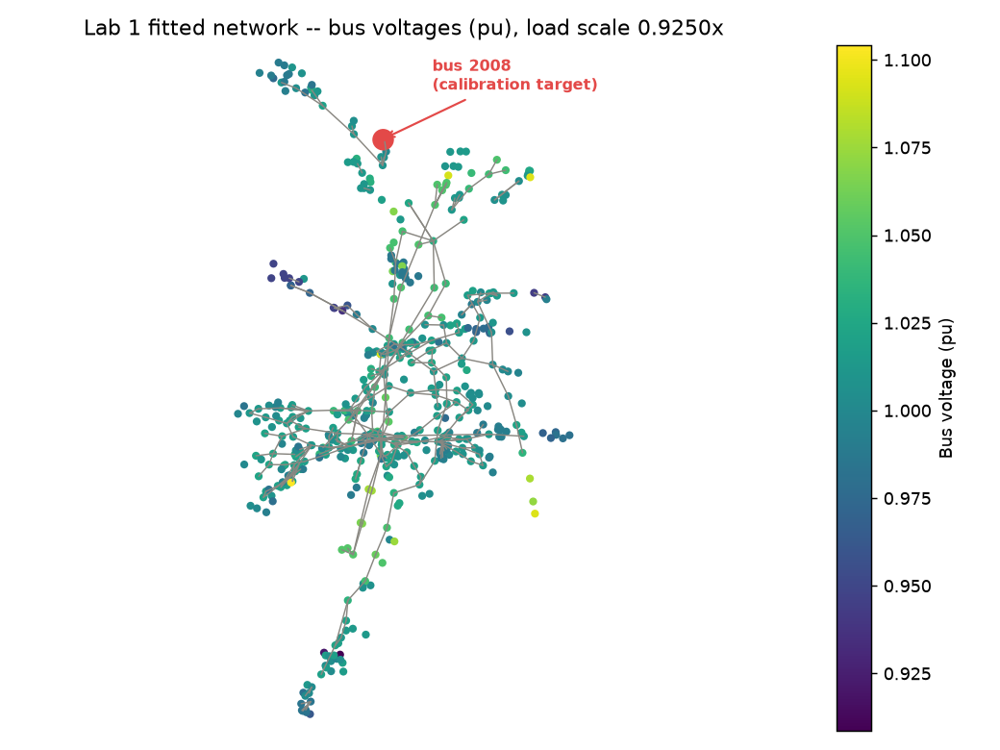

# Lab 1 (Simple) — Load-Flow Parameter Fit

Fitting a model to match a real measurement is one of the most common tasks in power-systems
engineering: you have a grid model, you have one real reading from the field (a SCADA meter), and
they don't quite agree — so you adjust a parameter until they do. This lab does the smallest
possible version of that.

*New to power flow / pu voltage? See the root [README's Concepts section](../../README.md#concepts-in-plain-terms).*

## What you'll do

1. Load `snemSA.m` — the South Australia slice of CSIRO's Synthetic-NEM-2000-Bus grid model — into
   [pandapower](https://www.pandapower.org/) via `powerio`.
2. Solve the base-case power flow and note the modelled voltage at bus 2008.
3. Search for a load-scaling factor (within ±10%) that brings bus 2008's modelled voltage to match
   a fixed "field SCADA" target (0.9422 pu) within 0.002 pu. Each trial value is picked by a simple
   bisection search (repeatedly halving the search range toward the answer); every trial is scored
   by a real `pandapower.runpp()` call, never guessed.
4. Compare the fitted parameter and residual against a known-good answer (`expected_results.json`).

The point of the lab is the split between the two roles: something *proposes* a trial value (here,
bisection search), and pandapower's real physics *evaluates* it. The physics is never in the
proposer.

## Design note: a deterministic proposer, not a model

This build uses bisection search as the proposer — the simplest way to show the propose/evaluate
split without needing a model server running. A local LLM choosing each trial value is a possible
future direction, not something this build does; the search loop and the real pandapower physics
underneath it are unaffected either way. See `labs/_shared/gridfit.py` for the swap point if you
want to wire a different proposer in.

## Command

```
uv run scripts/fetch_csiro_nem_data.py   # once, to populate data/snemSA.m
uv run labs/01-simple-loadflow-fit/run.py --step load
uv run labs/01-simple-loadflow-fit/run.py --step fit
uv run labs/01-simple-loadflow-fit/run.py --step check
uv run python -m pytest labs/01-simple-loadflow-fit/test_lab1.py
```

## Running in a container (Windows-friendly)

No local install needed — works identically under Docker Desktop, Podman Desktop, or native
podman/docker:

```
podman build -t nem-poweragent-base:local -f Containerfile.base .
podman build -t lab1:local -f labs/01-simple-loadflow-fit/Containerfile .
podman run --rm lab1:local
```

This reproduces the `--step check` output below. Override the step with, e.g.,
`podman run --rm lab1:local --step fit`.

## Step-by-step walkthrough

1. **`--step load`** — You should see `Loaded snemSA.m via powerio: 503 buses, 57 generators` then
   `Base-case power flow converged: bus 2008 voltage = 0.935 pu`. This is the "before" state: a
   modelled voltage that doesn't yet match the field reading.
2. **`--step fit`** — One line per search iteration, e.g. `iter 1: trial=1.0000x -> 0.935 pu
   (residual -0.0074)`, ending in `converged: trial=0.9250x, bus 2008 = 0.941 pu, residual -0.0008
   (PASS, tol 0.002)`, then `[chart] wrote sample_network_chart.png` — a network diagram with every
   bus colored by its solved voltage and bus 2008 highlighted, so the calibration target is visible
   in the wider network, not just a log line.

   
3. **`--step check`** — Prints the fit result as JSON, then `MATCH: fitted_scale=0.925
   residual_pu=-0.000791 vs expected_results.json`. If you don't want to run the fit live, reading
   `expected_results.json` directly shows the same thing this step prints on success.
4. **`pytest test_lab1.py`** — `2 passed`: the same check, plus an assertion that the chart file
   exists.

## Files

- `run.py` — the `load` / `fit` / `check` steps above. `--step fit` also regenerates
  `sample_network_chart.png`; `--step check` never touches it.
- `expected_results.json` — the known-good fixture `--step check` compares against.
- `sample_network_chart.png` — the committed network diagram (see `_plot_network` in `run.py`).
- `animate_convergence.py` — renders an animated version of the bisection search for presenter use
  (`animate_convergence.mp4`, not committed — regenerate with this script).
- `test_lab1.py` — pytest wrapper: `--step check` plus the chart-file assertion.
