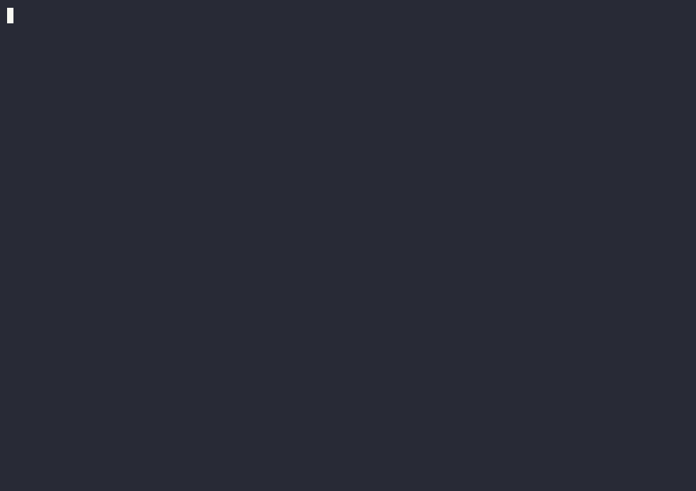
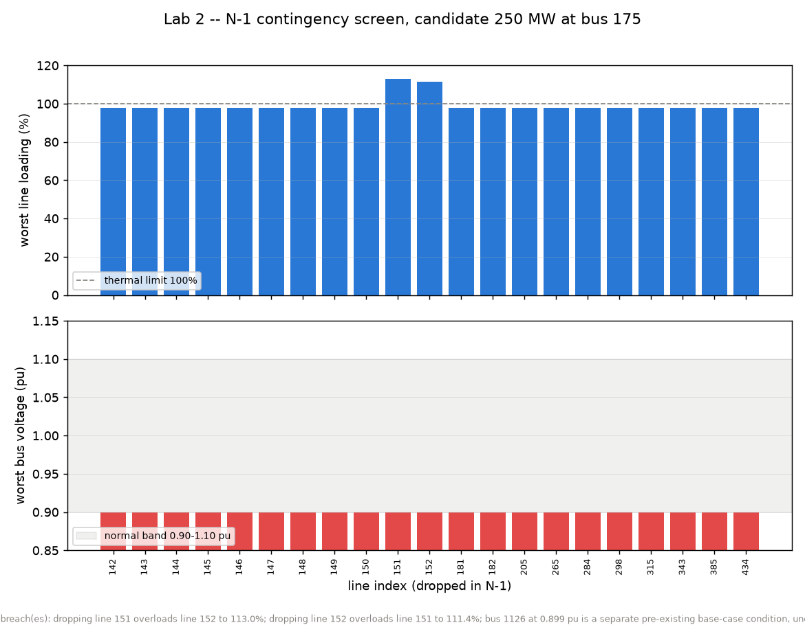
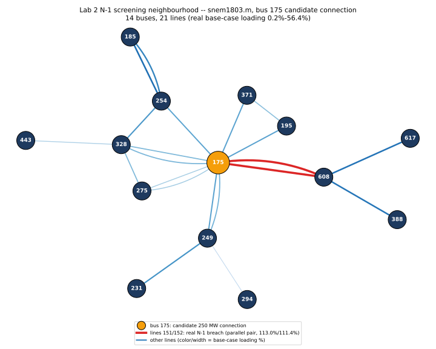

# Lab 2 (Medium) — Interconnection / Asset-Provisioning Screening

Before a new generator or big load can connect to the grid, the operator has to check it won't
break anything — including if a line or another generator drops out unexpectedly at the same time.
This lab runs that check for real: a candidate 250 MW generator, a full N-1 contingency screen, and
a human approval gate before anything is called final.

*New to N-1 contingency screening or pu voltage? See the root [README's Concepts section](../../README.md#concepts-in-plain-terms).*

## See it run



A narrated replay of `just check-lab2` — real 21-line N-1 screen, real cross-check against a second
solver, real output. Higher-quality version: [tour.mp4](tour.mp4). Regenerate it yourself:
`just tour::tour 2` (live, unrecorded) or `just tour::tour-record 2` (re-record + re-render).

## What you'll do

1. Load `snem1803.m` (the mainland NEM grid model) and attach a hypothetical 250 MW generator at
   bus 175, a real 132 kV bus with 21 lines within two hops of it.
2. Solve the base-case power flow with the candidate generator attached.
3. Run the N-1 screen: drop each of the 21 nearby lines, one at a time, and re-solve — as genuinely
   parallel OS processes (`concurrent.futures.ProcessPoolExecutor`), not a loop that just looks
   parallel.
4. Check every result against a simplified planning limit (voltage within 0.90–1.10 pu, line
   loading ≤100%) and produce a pass/fail table, plus a two-panel chart.
5. Draft a plain-English screening memo — blocked behind a human approval step that genuinely has
   to be satisfied before the memo is marked final.

The point of the lab: every physics step here is a deterministic script, not something an AI
reasons about numerically — the same "workflow automation with a real human checkpoint" pattern a
real interconnection study would need to defend.

## Design notes

The original spec (`docs/VISION.md` §7) runs these same four steps as a Microsoft Agent Framework
workflow calling a networked PowerMCP server for each physics step. This build calls `pandapower`
directly in-process instead — the physics, the real parallelism, and the human-approval gate are
all unaffected; only the transport is swapped. See `workflow.py`'s module docstring for the exact
call site you'd change to wire in the networked version.

Two things worth knowing before you read the output:

- `snem1803.m`'s default flat-start pre-solve hits a divide-by-zero (a zero-impedance branch, a
  common artifact of how MATPOWER models merge buses). `workflow.py` calls
  `pp.runpp(net, init="flat")` to skip that pre-solve; the AC solve then converges cleanly.
- The 0.90–1.10 pu / 100% limit band is a simplified stand-in for AEMO's real per-voltage-level
  limit table (NER Schedule 5.1a) — a real submission would use the exact table per voltage level,
  not one flat band.

## A real finding worth knowing before you read the table

Every one of the 21 contingencies shows a voltage breach at bus 1126 — but that's a **pre-existing
condition**: bus 1126 sits at 0.899 pu even with nothing dropped at all, so it isn't caused by any
of these contingencies. `check_limits()` labels it as such rather than letting a real-data quirk
look like a bug.

There are, however, two **genuinely contingency-induced** breaches, which is exactly what this
screen exists to catch: lines 151 and 152 are a parallel pair (both connecting the same two buses,
each carrying ~55–56% of the load normally). Drop either one, and the survivor has to carry both
circuits — 113.0% loading on line 152 when 151 is dropped, 111.4% on line 151 when 152 is dropped.
Both rows are marked FAIL for this reason specifically, distinct from the bus-1126 pre-existing
condition. `sample_contingency_chart.png` plots this directly: 19 of 21 bars sit flat at the
pre-existing ~97.8% / 0.899 pu point, while the 151/152 bars visibly cross the 100% line.



## pypowsybl N-1 cross-check (a real second opinion, not another stand-in)

> Full write-up, conclusions, and implications:
> [`docs/POWERFLOW_ENGINE_SHOOTOUT.md`](../../docs/POWERFLOW_ENGINE_SHOOTOUT.md).

`pypowsybl_cross_check.py` re-solves the exact same 21 contingencies as an independent, real
second opinion: [PowSyBl](https://github.com/powsybl) (RTE's power-system framework, via its real
`pypowsybl` Python bindings, OpenLoadFlow solver) against `workflow.py`'s own pandapower screen.
This promotes pypowsybl from `labs/03-advanced-provider-bakeoff/spike_pypowsybl.py`'s standalone
aggregate-loss comparison into a real, wired-in capability — a genuine cross-validation of the
same screening decision this lab already makes, using `labs/_shared/gridfit.py`'s
`to_pypowsybl_network()` / `pypowsybl_element_id_map()` helpers (shared with the Lab 3 spike, not
duplicated).

**Two more real pypowsybl data-fidelity gaps found while building this** (beyond Lab 3's
`.m`→`.mat` finding), both worked around in the shared helper, not silently masked:

- **Bus-id correlation is not `pandapower_bus_id + 1`.** pandapower's own bus index preserves the
  original MATPOWER bus numbers (often large and non-sequential — this repo's cases can go past
  10000), but the `.mat` file `to_mpc()` writes uses a *completely different*, internally
  renumbered 1-based sequence (pandapower's own `to_ppc()` bus compaction). Naively assuming
  `pandapower_bus_id + 1` matched pypowsybl's `LINE-<a>-<b>` element ids on only 14 of 1215 real
  lines; using pandapower's own `net._pd2ppc_lookups["bus"]` (the exact table `to_ppc()` builds
  internally) matched 1215/1215.
- **`matpower.import.ignore-base-voltage` defaults to `true`.** pypowsybl's MATPOWER importer
  silently discards the real per-bus base-kV column by default — every bus came back at
  `nominal_v=1.0` regardless of this repo's real NEM voltage levels (132kV, 66kV, 33kV, 11kV,
  etc., genuinely present in the `.mat` file), making reported voltages and currents physically
  meaningless. Confirmed this is a pure reporting-convention default (total system generation/
  load/loss are bit-identical either way) — `to_pypowsybl_network()` always passes this parameter
  as `false`.

**Result:** worst-case bus voltage per contingency matches to within **0.00000 pu** across all 21
contingencies (both engines independently confirm the base-case 0.899 pu breach at bus 1126 /
`VL-910`). Worst-case line loading agrees closely for the two *genuinely contingency-induced*
thermal breaches this lab exists to catch — lines 151/152's parallel-pair overload — matching
**exactly** (113.00% / 111.37%, both engines, both directions). The other 19 (non-contingency-
induced, pre-existing base-case) contingencies show a real ~3% relative loading difference,
consistent with a per-branch current-modelling difference between the two solvers (see
`pypowsybl_cross_check.py`'s own tolerance comment) — named honestly rather than tightened away.
**21/21 contingencies agree** within the documented tolerances.

```
uv run labs/02-medium-interconnection-screening/pypowsybl_cross_check.py --step run
uv run labs/02-medium-interconnection-screening/pypowsybl_cross_check.py --step check
```

## Network diagram (`sample_network_diagram.svg`)

`render_network_diagram.py` draws the same 14-bus/21-line N-1 neighbourhood `workflow.py`'s own
screen already computes — the diagram is a rendering of an already-verified result, not a new
source of truth (same convention as `sample_contingency_chart.png` above). Deliberately scoped to
this local neighbourhood, not the full `snem1803.m` (1803 buses, no geographic coordinates —
would render as an unreadable hairball); layout is `networkx.kamada_kawai_layout` (deterministic,
no RNG), rendered to a real vector SVG via matplotlib's `Agg` backend.

Candidate bus 175 is marked distinctly (orange, larger). Every real parallel-line pair in this
neighbourhood — not just the well-known 151/152 pair — is drawn as two genuinely separate curved
edges rather than collapsed into one: 143/150 (175↔249), 145/146 (175↔275), 147/148 (175↔328),
181/182 (185↔254), and 151/152 (175↔608). Edge color/width encodes base-case `loading_percent`
(a blue scale, deliberately *not* a red-family colormap — 181/182 load up to 43.6%/36.7%, near
the top of this neighbourhood's range, and a red colormap there would look identical to the one
genuine finding below). Lines 151/152 are the sole exception: hard-coded bright red, since they
are the only *contingency-induced* breach this lab's screen actually found (see Design notes
above) — every other parallel pair here is a normal double-circuit, not a violation.



```
uv run labs/02-medium-interconnection-screening/render_network_diagram.py
```

## Command

```
uv run scripts/fetch_csiro_nem_data.py   # once, to populate data/snem1803.m
uv run labs/02-medium-interconnection-screening/workflow.py --step base
uv run labs/02-medium-interconnection-screening/workflow.py --step contingencies
uv run labs/02-medium-interconnection-screening/workflow.py --step check-limits
uv run labs/02-medium-interconnection-screening/workflow.py --step memo --approve APPROVE
uv run python -m pytest labs/02-medium-interconnection-screening/test_lab2.py
```

## Running in a container (Windows-friendly)

No local install needed — works identically under Docker Desktop, Podman Desktop, or native
podman/docker:

```
podman build -t nem-poweragent-base:local -f Containerfile.base .
podman build -t lab2:local -f labs/02-medium-interconnection-screening/Containerfile .
podman run --rm lab2:local
```

This reproduces the `--step check` output below. Override the step to see the human-approval gate:
`podman run --rm lab2:local --step memo --approve APPROVE`.

## Step-by-step walkthrough

1. **`--step base`** — `Loaded snem1803.m, attached candidate 250 MW generator at bus 175` then
   `Base-case power flow converged: True`. The "does the case even solve before we stress it" gate
   every real screening study starts with.
2. **`--step contingencies`** — `Contingency 1/21 complete (line 143 [175-249] dropped: no
   violations)` ... through 21/21, arriving in completion order rather than submission order,
   because they really are running as parallel processes. (No live run needed to follow along —
   `expected_contingency_table.json` has the full pre-computed table.)
3. **`--step check-limits`** — A table (line, from/to bus, worst voltage, worst loading, pass/fail)
   where every row is FAIL: 19 for the pre-existing bus-1126 condition, lines 151/152 for the real
   contingency-induced overload above. Ends with `[chart] wrote sample_contingency_chart.png`.
4. **`--step memo --approve APPROVE`** — The drafted memo, reporting "2 contingency(ies) BREACH
   limits as a direct result of the outage: line 151/152 ...", then `Human-in-the-loop checkpoint:
   APPROVE received -> MEMO FINALIZED.` Run the same command *without* `--approve APPROVE` (piped
   from `/dev/null`, so there's no terminal to prompt) to see it refuse instead: `BLOCKED, awaiting
   human approval` and a non-zero exit.
5. **`pytest test_lab2.py`** — `3 passed`: the fixture match, the blocks-without-approval case, and
   the finalizes-with-approval case.
