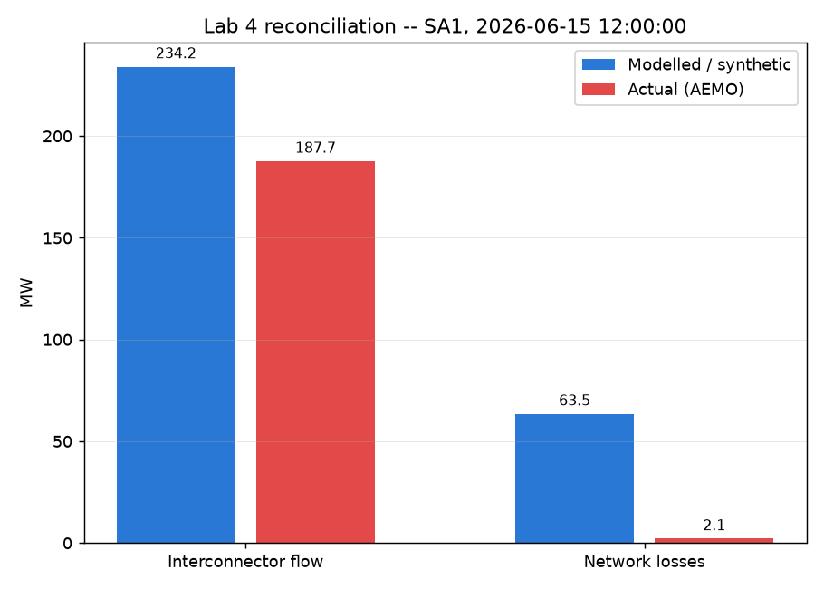

# Lab 4 — Real AEMO Data: Digital-Twin Reconciliation & Constraint Literacy

Every other lab in this repo runs against synthetic data — safe, fast, offline, but easy to
dismiss as "toy." This lab is where a real network meets real market data: it pulls one real day
of South Australian dispatch data from AEMO's public archive, imposes it on a synthetic grid model,
and checks whether the model's power flow reconstructs what actually happened. It doesn't (see
below) — and explaining *why* it doesn't, with a real computed number, is the actual point.

**Two things to know going in**: `snemSA.m` is a *synthetic* topology, not a real map of the SA
grid — this is not a digital twin of the real network. And Part C (below) is a guided reading of
AEMO's own public incident report, not a claim that this model reproduces that event's cause.

*New to interconnectors or MW/MVA? See the root [README's Concepts section](../../README.md#concepts-in-plain-terms).*

## What you'll do

- **Part A** — pull one real day (15 June 2026) of South Australian dispatch data via
  [NEMOSIS](https://github.com/UNSW-CEEM/NEMOSIS), map real generators onto `snemSA.m`'s synthetic
  ones, impose their real output levels, solve a power flow, and compare the modelled
  interconnector flow to AEMO's actual reported value. The tolerance is deliberately generous — a
  synthetic topology meeting real data is expected to diverge — and the result is scored honestly
  either way, not tuned to pass.
- **Part B** — decode one real binding constraint for the same day using the public
  [`susantoj/NEM_constraints`](https://github.com/susantoj/NEM_constraints) library, and print a
  plain-English translation of it.
- **Part C (optional)** — replay the same reconciliation mechanic against real pre-event dispatch
  data from the 28 September 2016 SA Black System.

## The actual result: Part A fails its own tolerance, and explains why

`reconcile.py` prints `FAIL`, and its memo says why: the synthetic network's own line/transformer
losses (63.5 MW) are about 30× the real interconnectors' reported losses for the same interval
(2.1 MW) — accounting for most of the gap. A wrong number with a right explanation is more useful
than a number quietly tuned to pass, which is the whole discipline this lab demonstrates.

## Design notes

- **`NEM_constraints` is vendored, not installed** (`nem_constraints_vendored.py`) — the upstream
  repo has no `pyproject.toml`/`setup.py`, so there's nothing for a package manager to build from
  its git URL. The vendored copy cites the exact upstream file/commit under its original MIT
  license, with two changes: a fix for a real bug in upstream's URL construction (it double-encodes
  a character, producing an HTTP 404 for recent dates), and a caching layer around the archive
  download this lab calls repeatedly. The actual constraint-decoding logic is untouched.
- **DUID matching uses capacity proximity, not fuel type** — `snemSA.m`'s generator metadata
  carries no fuel-type field, and AEMO's fuel-type registration list is served behind bot
  protection that blocks scripted fetches. `map_duids.py` uses the spec's own documented fallback:
  matching each real generator to a synthetic one by nameplate-capacity proximity.
- **"Capacity" here is a day-max-SCADA proxy, not registered capacity** — the table that has true
  registered capacity is only queryable by scanning every month back to 2009 (confirmed: 200+
  archive downloads, several minutes, for one number), disproportionate for a lab step that should
  run in seconds. Each generator's own day-max real output is used as a physically-grounded proxy
  instead.
- **The "interconnector" being reconciled against** is `snemSA.m`'s single slack generator (the
  reference bus every islanded model needs to solve), which this lab treats as standing in for the
  real Heywood + Murraylink interconnectors combined — `snemSA.m` is an SA-only island with no
  explicit connection to Victoria modelled at all. This assumption is asserted at runtime in
  `_lab4_shared.py`, so a future data revision that breaks it fails loudly instead of silently
  reconciling against the wrong bus.
- **Unmatched synthetic generators are set to 0 MW.** The capacity-proximity matching isn't 1:1 (89
  real generators vs. 56 synthetic ones), so roughly a third of synthetic generators get no real
  match. Leaving them at their original base-case output double-counts capacity and fails to
  converge; zeroing them means the model only asserts generation it has real evidence for.
- **Tolerance: ±15%, floor 10 MW** — deliberately looser than Lab 1's tight fit tolerance, because a
  synthetic topology meeting real market data is expected to diverge on absolute terms, not just
  solver noise. The floor exists so a near-zero real flow (which does happen) can't make the
  relative check meaningless.
- **The memo text is a plain string template**, not LLM-generated free text — same design choice as
  every other lab (see Lab 1's README).
- **Part C reuses Part A's DUID mapping across a 10-year gap** — built from generators registered
  as of 2026, applied to 2016 data. A generator active in 2016 may since have been decommissioned
  or re-registered; `reconcile.py --date 2016-09-28`'s memo names this as an extra source of error
  on top of Part A's network-loss explanation.

## Command

```
uv run labs/04-aemo-digital-twin-reconciliation/fetch_day.py --region SA1 --date 2026-06-15
uv run labs/04-aemo-digital-twin-reconciliation/map_duids.py
uv run labs/04-aemo-digital-twin-reconciliation/reconcile.py
uv run labs/04-aemo-digital-twin-reconciliation/reconcile.py --step check
uv run labs/04-aemo-digital-twin-reconciliation/explain_constraint.py
uv run labs/04-aemo-digital-twin-reconciliation/reconcile.py --date 2016-09-28   # optional Part C
uv run python -m pytest labs/04-aemo-digital-twin-reconciliation/test_lab4.py
```

## Running in a container (Windows-friendly)

No local install needed — works identically under Docker Desktop, Podman Desktop, or native
podman/docker:

```
podman build -t nem-poweragent-base:local -f Containerfile.base .
podman build -t lab4:local -f labs/04-aemo-digital-twin-reconciliation/Containerfile .
podman run --rm lab4:local
```

Unlike Labs 1–3, this container needs outbound network access at run time — it pulls real AEMO
data live, no offline fallback — which the default container network already provides.

## Step-by-step walkthrough

1. **`fetch_day.py --region SA1 --date 2026-06-15`** — A short progress log as data downloads and
   caches, ending in `cached 151475 rows across 4 tables`. (No offline fixture is shipped — the
   live pull for this date is this script's only tested path.)
2. **`map_duids.py`** — A table of real generator → matched synthetic bus → capacity diff (70 real
   generators mapped onto 22 synthetic buses), also written to `duid_mapping.csv` so the mapping is
   auditable, not hidden in code.
3. **`reconcile.py`** — `Modelled interconnector-equivalent flow (bus 985): +234.2 MW`, `Actual
   combined flow: +187.7 MW`, `Delta: +46.5 MW ... -> FAIL`, then the memo explaining the gap (see
   above), then `[chart] wrote sample_reconciliation_chart.png`.

   
4. **`reconcile.py --step check`** — The result as JSON, then `MATCH: modelled=234.168
   actual=187.7 vs expected_reconciliation.json`. This checks that the computation *reproduces the
   fixture*, not that reconciliation passed — the fixture's own `"passed": false` is the correct,
   reproducible answer.
5. **`explain_constraint.py`** — A search across the day's binding constraints, landing on a real
   one (e.g. `NSA_S_TB2_40`, "Torrens Island (TIPS) B2 >= 40 MW for Network Support Agreement"),
   its decoded terms, cross-referenced against `duid_mapping.csv`, and a plain-English translation.
6. **(optional) `reconcile.py --date 2016-09-28`** — Prints the caveat first — this is not a claim
   of reproducing the 2016 SA Black System's actual cause — then a short excerpt from AEMO's public
   report, then the same reconciliation shape as step 3, with the DUID-mapping date gap named as an
   extra source of error.

## References (Part C)

- [AEMO's integrated final report — Black System South Australia 28 September 2016](https://www.aemo.com.au/-/media/files/electricity/nem/market_notices_and_events/power_system_incident_reports/2017/integrated-final-report-sa-black-system-28-september-2016.pdf)
- [AER investigation report — South Australia's 2016 state-wide blackout](https://www.aer.gov.au/publications/reports/compliance/investigation-report-south-australias-2016-state-wide-blackout)
