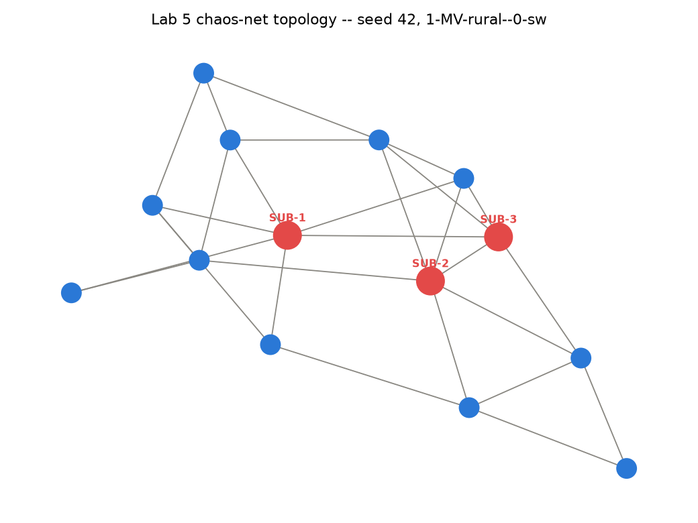
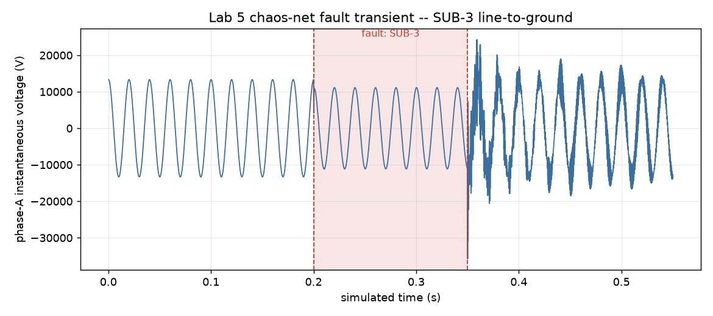
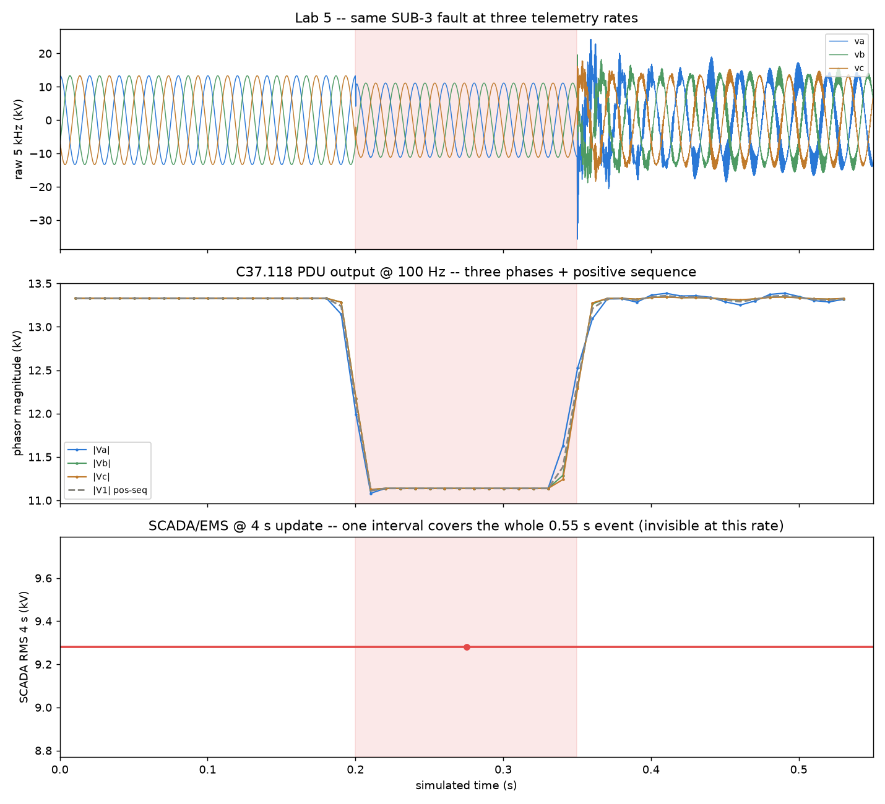
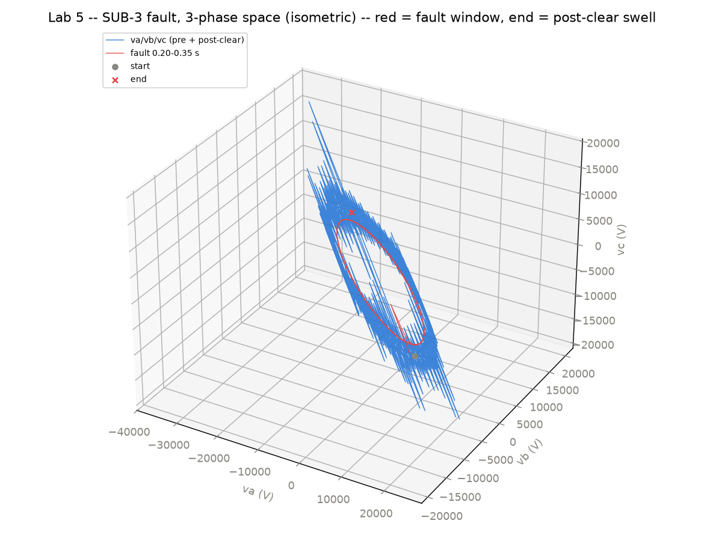
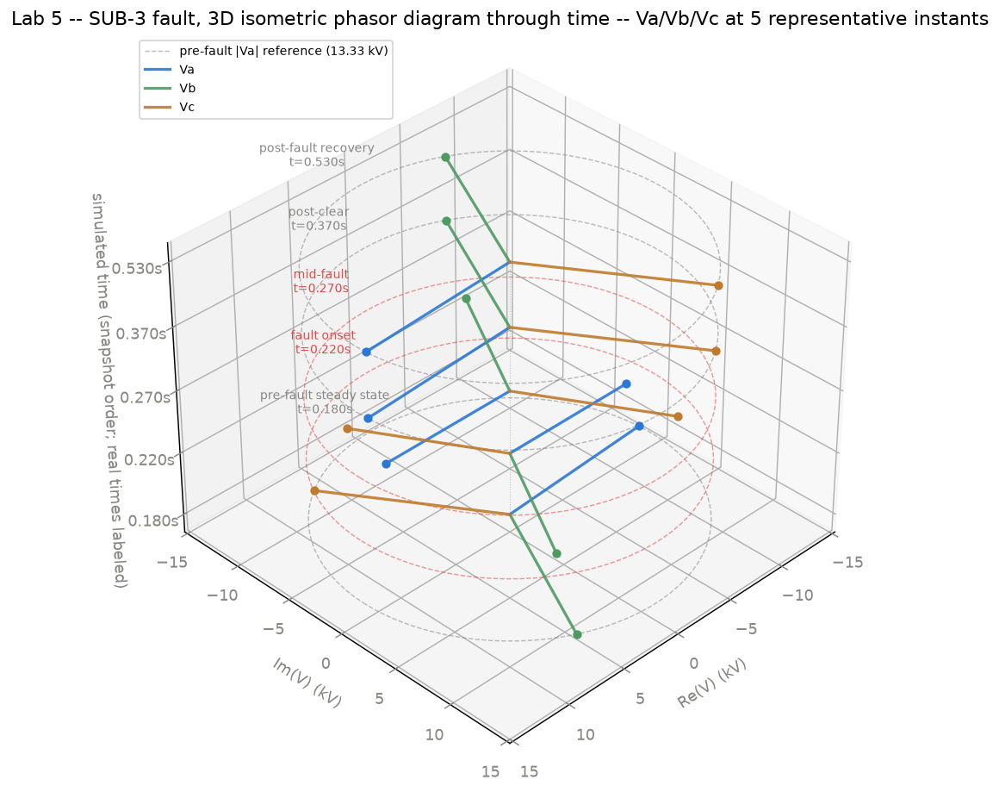
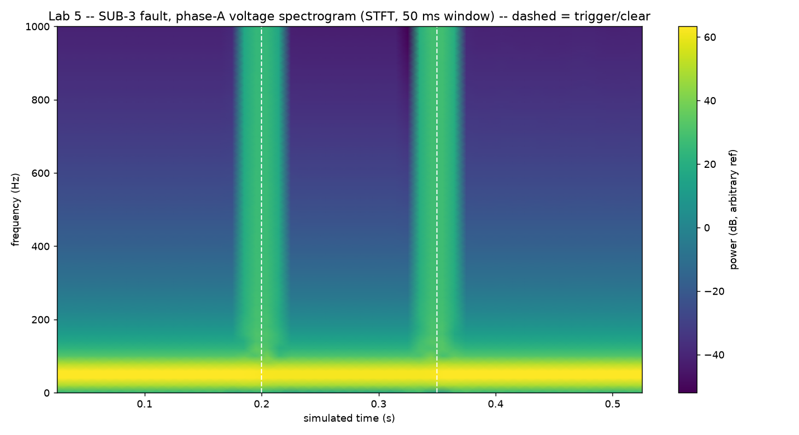
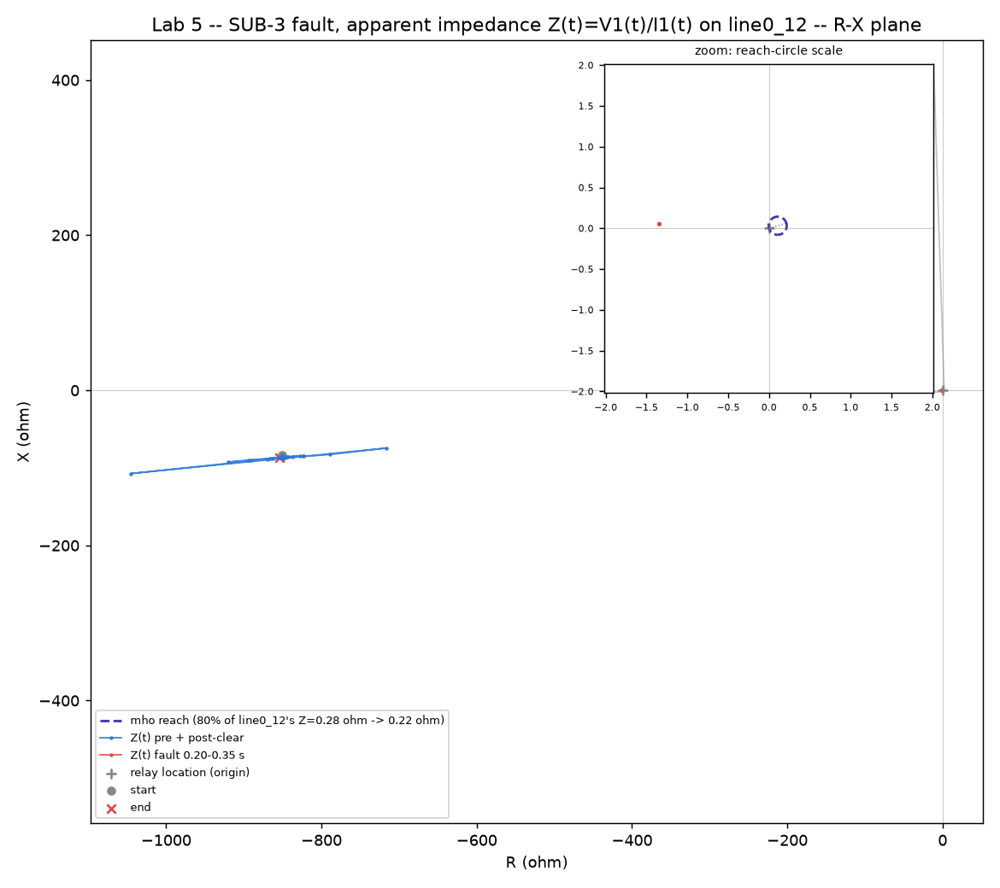

# Lab 5 — SPARTAN Chaos-Net: Transient Streams via DPsim + VILLASnode

> Status: **implemented** (laptop-portable core). Full concept, architecture, and the split
> Definition of Done live in
> [`docs/LAB5_SPARTAN_CHAOSNET.md`](../../docs/LAB5_SPARTAN_CHAOSNET.md). This README is the
> lab-local summary and build notes.

*New to EMT solves, grid-forming control, or symmetrical components? See
[Concepts for this lab](#concepts-for-this-lab) below, and the root
[README's Concepts section](../../README.md#concepts-in-plain-terms) for power-flow basics.*

## What you'll do

- Procedurally generate a new "chaos-net" grid topology each run: a real SimBench seed grid
  (`1-MV-rural--0-sw`) perturbed by a NetworkX Watts-Strogatz graph rewiring, checked with a real
  `pandapower.runpp()`.
- Run a network-wide EMT solve (see Concepts below) in
  [DPsim](https://github.com/sogno-platform/dpsim) at a 200µs timestep, driven by a scheduled fault
  file (`chaos_schedule.yaml`) and a real `dpsimpy.event.SwitchEvent3Ph`.
- Stream the fault substation's voltage/current samples out via a real, running
  [VILLASnode](https://github.com/VILLASframework/node) pod (`podman kube play
  kube/villasnode-tap-pod.yaml`), verified by a real UDP capture in `verify_stream.py`.

The full pipeline runs on a laptop, no physical hardware — a stub UDP receiver stands in for
SPARTAN's data recorder. Validating against a real Radxa Dragon Q8B board is a separate,
hardware-gated extension, not attempted here (see the design doc).

This lab does not implement SPARTAN's anomaly-detection logic (a later phase, out of scope), and
its "chaos-net" topologies are procedurally generated stress scenarios, not a model of any real
substation.

## Why this matters

Every other lab in this repo works at the dispatch-interval timescale (minutes). This one is the
waveform timescale — the level real protection relays and PMUs operate at — applying the same
"deterministic, checkable" discipline to generating labeled stress-test data for an edge anomaly
detector.

## Concepts for this lab

- **EMT (electromagnetic transient) solve** — instead of assuming the grid has already settled (the
  "steady-state" the other labs use), an EMT solver steps through actual voltage/current waveforms
  thousands of times per second, capturing the physics of the first fraction of a second after a
  fault — including the transient that dies out before things return to steady state.
- **Grid-forming vs. grid-following inverter control** — a grid-following inverter tracks the grid's
  existing voltage/frequency and injects power to match it. A grid-forming inverter instead *sets*
  its own voltage/frequency, the way a spinning generator naturally does, and can actively support
  the grid during a disturbance. Phase 1 below builds a grid-forming controller.
- **Symmetrical components (V0/V1/V2)** — any unbalanced 3-phase voltage or current can be split
  into three balanced sets: positive-sequence (V1, the normal rotating field), negative-sequence
  (V2, present during unbalanced faults), and zero-sequence (V0, present when there's a path to
  ground). Each sequence behaves independently in a linear network, which makes unbalanced faults
  tractable to analyze.
- **RoCoF (rate of change of frequency)** — how fast grid frequency is moving, in Hz/s. A large
  RoCoF usually signals a big loss of generation or load; protection relays can trip on it.
- **Smith predictor / deadtime compensation** — a control-theory technique for a process whose
  effect is delayed (e.g. by signal travel time down a cable): the controller runs an internal model
  forward by the known delay so it reacts to a predicted current state instead of an already-stale
  measurement.

## Corrective control: the grid-forming stabilizer (PRD-0005 Phase 1)

Every other view in this lab implements the "classify/log/alert" half of SPARTAN's own design (a
micro-PMU-based distributed emergency-response coordinator). `grid_forming.py` is the other half: it
actively injects a compensating voltage at the fault bus and measures whether it helps.

**Scope**: this is the conventional VSM/PID fallback control law the PRD allows, not the
Negative-Imaginary (NI) systems-theoretic controller it names as first choice — fitting DPsim's
plant model to NI's stability conditions is a genuinely open question this phase didn't attempt to
resolve (see `grid_forming.py`'s module docstring). What's kept from the PRD: the controller's
angle/frequency state follows the same swing-equation structure (inertia + damping opposing a
measured power imbalance) DPsim's own generator models use, plus a separate voltage-magnitude droop
loop — driving a `ControlledVoltageSource` instead of a literal rotating machine.

**Circuit placement**: a shunt-connected voltage source (like a real STATCOM/DVR), coupled through a
small series R+jX filter to the fault bus itself. Sensor and actuator are collocated at that one bus
— the standard real-world STATCOM/DVR placement.

**Measured result** (seed 42, the committed SUB-3 fault, 1.0 MVA device): peak positive-sequence sag
depth went from **16.62% (baseline) to 16.42% (stabilized)** — a real, reproducible **+0.20
percentage-point (≈1.2% relative) reduction**. Recovery time (until |V1| settles within 2% of
pre-fault) was identical in both runs (~0.0104s): the correction is too small here to change how
fast the network itself recovers. Peak RoCoF was ~9999–10000 Hz/s in *both* runs — see the note
below on why that number isn't a real frequency-stability measurement.

**Why the effect is small**: the fault switch is a 0.5 Ω near-bolted short at the same bus the
stabilizer is coupled to. By voltage-divider reasoning, that low-impedance path dominates almost
regardless of how hard the controller drives its output — most of the stabilizer's injected current
splits through the fault rather than raising the bus voltage. This is a real structural limit of a
shunt device fighting a bolted fault at its own terminal (real-world Dynamic Voltage Restorers are
usually connected in *series* for exactly this reason — a natural next step, not attempted here).

**On the RoCoF number**: this network has one ideal fixed-frequency source and otherwise only
passive branches — there's no rotating-mass dynamics for a genuine frequency excursion to occur
against. The ~10,000 Hz/s figure is an *apparent* RoCoF artifact from the DFT phase estimate
jittering right at the fault-switching instant, not a real frequency event. Included because it's a
real, reproducible number from the existing phasor machinery, reported for what it is.

**Never claimed**: this controller does not eliminate the transient — it measurably shrinks its peak
depth by a modest, honestly-reported amount, for the physical reason above.

`grid_forming.py --step run` (or `just lab5-stabilizer`) writes `dpsim_transient_log_stabilized.json`
and `stabilizer_comparison.json` (gitignored, regenerated every run).

## From EMT margin to steady-state headroom (PRD-0005 Phase 1.5)

Phase 1 is an EMT/time-domain result — it says nothing about whether the sag-depth reduction matters
to AEMO's actual steady-state dispatch/constraint layer, a `pandapower` load-flow question.
`headroom_translation.py` answers that, using the *identical* seed-42 topology Phase 1's DPsim run
solved (not Lab 1/2/4's unrelated fixed network).

**Not literal OPF**: this reuses Lab 2's `check_limits()` pattern — a `pandapower.runpp()`
steady-state loadflow against a 100%-of-nameplate thermal limit and a 0.90–1.10 pu voltage band.
That's a limit *screen*, not a cost-optimizing dispatch, and is called that throughout the script.

**Translation hypothesis (there is no established technique for this step)**: the script applies
Phase 1's measured relative sag-depth improvement (**+1.19%**) as an equal fractional increase to
the fault-adjacent line's thermal rating (`max_i_ka`) — on the premise that if the line's dynamic
rating was set conservatively because of transient sag, a stabilizer that reduces the sag could
support a proportionally higher rating. This is explicitly **not** a computed engineering-standard
derivation; the equally defensible alternative (sag depth and thermal loading are different physical
quantities that don't translate at all) is named in the script's own docstring, chosen only so the
binding-constraint question could be tested end to end rather than left abstract.

**Result** (seed 42, line `line0_12`): baseline shows this network nowhere near any binding
constraint — worst line loading **6.12%**, worst bus voltage **0.9994 pu**, zero breaches. Applying
the translation drops that line's loading to 6.05% — a real but tiny movement, nowhere near flipping
any breach status.

**Verdict: NO** binding-constraint change. This is the PRD's own explicitly acceptable outcome, not
a failure: this small, lightly-loaded 14-bus/28-line network simply isn't stressed anywhere near a
limit under normal conditions, so a sub-2%-relative rating adjustment on one line has nowhere to
show up. A larger or more heavily loaded network could plausibly show a different answer — not
attempted here.

`headroom_translation.py --step run` (or `--step check`) regenerates `headroom_translation.json`
(gitignored) with the full before/after screens and the conclusion above.

## Cable-length propagation-delay compensation (PRD-0005 Phase 2)

Does adding deadtime/Smith-predictor compensation (see Concepts above) to Phase 1's controller,
time-aligned to the fault-adjacent line's real propagation delay, measurably improve mitigation over
Phase 1's uncompensated baseline — or is a simple fast droop loop already good enough that the extra
complexity buys nothing? `delay_compensation.py` adds the compensation term as an opt-in extension
of `GridFormingStabilizer` (`delay_compensation_enabled`/`delay_s`, off by default, reproducing
Phase 1 exactly) and answers with a real three-way comparison.

**The propagation delay, computed, not assumed.** The fault-adjacent line (`line0_12`) has
`length_km=0.6`, `r_ohm_per_km=0.443`, `x_ohm_per_km=0.132`, `c_nf_per_km≈190` — real SimBench
per-km parameters consistent with underground MV cable (low reactance, high capacitance vs. a
typical overhead line), matching the seed grid's real source (German MV distribution, predominantly
underground even in "rural" SimBench classifications). Using the standard TEM-mode cable propagation
velocity `v = c / sqrt(er)` with XLPE's typical relative permittivity `er ≈ 2.3` gives `v ≈ 197,677
km/s`, and `0.6 km / 197,677 km/s ≈ 3.035 µs`.

*Caveat*: Phase 1's stabilizer is coupled at the same bus as the fault switch, so this delay isn't
literally in this circuit's control loop today — it's used as this phase's own named prototype-scale
deadtime parameter ("prototype it small and measure"). A genuinely remote/series-coupled stabilizer
(a future variant) is where it would apply literally.

**The compensation term**: a first-order forward extrapolation of each measurement by `delay_s`,
using the measured rate of change since the last control tick —
`x_predicted = x_measured + delay_s * (x_measured - x_previous) / dt_control`.

**Three-way comparison** (seed 42, real computed peak sag depths):

| Configuration                                 | Peak sag depth |
|------------------------------------------------|----------------|
| No stabilizer (baseline)                       | **16.62%**    |
| Stabilizer, no delay compensation (Phase 1)     | **16.42%**    |
| Stabilizer, with delay compensation (Phase 2)   | **16.42%**    |

The middle row reproduces Phase 1's own result exactly (confirming Phase 2's new code didn't change
Phase 1's default behavior). The compensated run differs from the uncompensated one by **+0.0003
percentage points** — below the script's own 0.001 pp reporting precision, i.e. indistinguishable
from noise.

**Verdict: NO MEASURABLE EFFECT** — one of the two explicitly acceptable outcomes PRD-0005 names.
This makes sense in context: the computed delay (3.035 µs) is ~0.03% of the controller's own
control-tick period (10 ms, matching a real PMU update rate) and ~0.002% of the fault's 150 ms
duration. A predictor driven by measurements that only update every 10 ms can't resolve a 3 µs
shift — the correction it computes is on the order of millivolts against a droop loop already only
correcting single-digit volts. This isn't evidence the Smith-predictor code is wrong (a synthetic
unit test in `test_lab5.py` confirms the same code path produces a clearly nonzero, correctly-signed
correction when the signal's rate of change is large enough to matter) — it's a real finding about
*this* line length and controller update rate: a 0.6 km MV cable's delay is simply too small, at
these timescales, to matter. A much longer line or a much faster controller could plausibly show a
different answer — not attempted here.

`delay_compensation.py --step run` (or `--step check`) regenerates `delay_compensation.json`
(gitignored) with the full comparison and conclusion above.

## Design notes

Most of this lab is real infrastructure, actually run: `podman` (5.4.2), the real VILLASnode OCI
image (`registry.git.rwth-aachen.de/acs/public/villas/node:latest`, 2.24 GB — note
`docker.io/villas/node` does not exist, it 403s), and `dpsim`/`simbench`/`networkx` all install and
import cleanly via `uv add`. The places something had to be substituted are named here explicitly.

1. **Balanced/decoupled 3-phase line and load model.** `chaosnet.py` builds each 3-phase line/load
   from a *diagonal* R/L/C matrix (no phase-to-phase mutual coupling), derived from SimBench's real
   per-km R/X/C columns — the same positive-sequence model pandapower's own power-flow uses,
   extended into 3 symmetric phases. A full untransposed-line model would need a real
   conductor-geometry mutual-impedance matrix, which SimBench doesn't supply.

2. **Fault severity: 0.5 Ω line-to-ground, not bolted.** Swept 0.2 / 0.5 / 1.0 / 2.0 Ω: 0.2 Ω gave a
   dramatic 33% sag but a ~4.3×-nominal switching spike; 0.5 Ω gives a clean, numerically stable
   16.4% sag with no NaNs. See `chaosnet.py`'s `FAULT_CLOSED_RESISTANCE_OHM`.

3. **Bounded simulated duration + a wall-clock countdown.** `run_dpsim.py` simulates ~0.55s of grid
   time (settle → fault → clear → recovery), not an open-ended stream — a scoping choice (DPsim
   itself can run longer; a real 4kHz stream for SPARTAN would keep going). The "in 8s... 7... 6..."
   countdown is real wall-clock time (`time.sleep`), separate from the fault schedule's own
   simulated `trigger_time_s` — two different clocks, both real. `--step check` uses a 0-second
   countdown so tests don't spend 8 seconds per run; the interactive walkthrough gets the full 8s.

4. **DPsim → VILLASnode transport: a file, not a live socket.** DPsim ships a native VILLASnode
   interface (`dpsimpyvillas.InterfaceVillas`) that can stream directly between running processes.
   This lab uses simpler, more robust wiring instead: `run_dpsim.py` writes the real fault-tap
   voltage waveform to `villas/chaos_stream.csv` in VILLASnode's own `file`/`csv` format, and the
   separately-running VILLASnode pod reads that file. This decouples the DPsim run's lifecycle from
   the pod's, at the cost of not being a live indefinite stream. Wiring `InterfaceVillas` directly
   for a true live tap is the documented next step.

5. **VILLASnode output: `socket` (UDP/JSON), not `iec61850-9-2`.** The target framing was real IEC
   61850-9-2 Sampled Values, and the image's `iec61850-9-2` node-type does compile and load — but
   actually starting it fails every time (`Failed to create SV publisher`), taking the whole process
   down. Root cause, confirmed by reading the image's own source: that node-type needs a raw
   `AF_PACKET` socket, and this host runs **rootless** Podman — the kernel checks the raw-socket
   capability against the network namespace's *owning user namespace*, and rootless Podman's private
   namespace never has that capability against the host's real network namespace. This is a genuine
   kernel security boundary, not a config mistake (see
   [containers/podman #19009](https://github.com/containers/podman/discussions/19009)). Three escape
   routes were tried — a private (non-host) network namespace (the raw socket opens, but the
   rootless `pasta` network backend doesn't forward IEC 61850's raw Ethernet frame type at all, so it
   would silently drop every packet); `macvlan` (creates cleanly but rootless Podman can't actually
   attach it to a physical NIC, so it's backed by the same pasta plumbing); and confirming the
   image's underlying library (`libiec61850`) does support a *routable*, ordinary-UDP SV variant,
   but VILLASnode's own node-type code never calls it. None fixes this without genuine root or
   running `villas-node` on bare metal. Full investigation trail is in `villas/chaos-tap.conf`'s
   header comment. The node this lab actually runs, and `verify_stream.py` connects to, is
   `sub-3-tap`: `type = "socket", layer = "udp", format = "json"` — a real, running, UDP/JSON
   stream, verified end to end.

6. **`hostNetwork: true` in `kube/villasnode-tap-pod.yaml`.** VILLASnode's socket node sends
   *outbound* UDP to `127.0.0.1:12000`; a bridged/port-published pod network only forwards *inbound*
   traffic, so a plain port mapping silently drops every outbound packet. `hostNetwork: true` is the
   fix, along with moving VILLASnode's own web/API server off port 80 (`http = { port = 8761 }` in
   `chaos-tap.conf` — port 80 isn't bindable under `hostNetwork` without root).

## Command

```
uv run labs/05-spartan-chaosnet-transient-stream/generate_topology.py --seed 42
uv run labs/05-spartan-chaosnet-transient-stream/generate_topology.py --step check

uv run labs/05-spartan-chaosnet-transient-stream/run_dpsim.py --schedule labs/05-spartan-chaosnet-transient-stream/chaos_schedule.yaml
uv run labs/05-spartan-chaosnet-transient-stream/run_dpsim.py --step check

podman kube play kube/villasnode-tap-pod.yaml
uv run labs/05-spartan-chaosnet-transient-stream/verify_stream.py --node sub-3-tap
podman kube play --down kube/villasnode-tap-pod.yaml

uv run labs/05-spartan-chaosnet-transient-stream/verify_stream.py --step check

uv run labs/05-spartan-chaosnet-transient-stream/grid_forming.py --step run
uv run labs/05-spartan-chaosnet-transient-stream/grid_forming.py --step check

uv run labs/05-spartan-chaosnet-transient-stream/headroom_translation.py --step run
uv run labs/05-spartan-chaosnet-transient-stream/headroom_translation.py --step check

uv run python -m pytest labs/05-spartan-chaosnet-transient-stream/ -v
```

`run_dpsim.py` must be run at least once before `podman kube play` — it writes the real
`villas/chaos_stream.csv` the pod reads (see Design note 4 above; gitignored, regenerated on every
run, same pattern as Labs 1–4's fetched/derived data).

## Running in a container (recommended on Windows)

This repo's pinned `dpsim==1.2.1` ships `manylinux` wheels only — no native Windows wheel at this
pin (later `dpsim` releases do publish `win_amd64` wheels; see
`docs/prd/0005-grid-forming-stabilizer-and-renewable-models.md` Phase 0 for why this repo hasn't
moved off 1.2.1). Docker Desktop or Podman Desktop (both run on Windows via WSL2) sidesteps this by
running the real Linux wheel inside the container, identically to native Linux/macOS:

```
podman build -t nem-poweragent-base:local -f Containerfile.base .
podman build -t lab5:local -f labs/05-spartan-chaosnet-transient-stream/Containerfile .
podman run --rm lab5:local
```

(Swap `podman` for `docker` if that's what you have.) The default run chains the same 5 checks
`just check-lab5` runs natively — several minutes total, not a quick command like Labs 1–3.
`verify_stream.py --step check` validates the committed fixture, not a live VILLASnode pod, so no
nested podman-in-container is needed for this default; the live-pod walkthrough (`podman kube play
kube/villasnode-tap-pod.yaml`) still needs a real podman/Linux host (or WSL2).

## Step-by-step walkthrough (presenter / backup script)

1. **`generate_topology.py --seed 42`** — Output:
   `Seeded from simbench code 1-MV-rural--0-sw, perturbed: 14 buses, 28 lines, 3 substations tagged
   as tap points (SUB-1, SUB-2, SUB-3)`, then `pandapower.runpp() converged: True (mean bus voltage
   0.9997 pu)`. The edge count (28, not the design doc's illustrative 17) is this seed's real
   Watts-Strogatz output, printed honestly rather than forced to match the doc's example. Also
   renders the graph itself, tap substations labelled larger, to `sample_topology_plot.png`.
   — *Backup if unavailable*: the committed `sample_topology.json` fixture (a real seed-42 run) plus
   the pre-rendered `sample_topology_plot.png`.

   

2. **`run_dpsim.py --schedule chaos_schedule.yaml`** — Output:
   `EMT solve running at 200us timestep`, then `[T+00:00] fault scheduled at substation SUB-3 in
   8s...` counting down (real wall-clock seconds — see Design note 3), then `FAULT INJECTED: SUB-3
   line-to-ground, clearing in 150ms`, then `FAULT CLEARED: SUB-3 restored to pre-fault topology`,
   then `Pre-fault 9425 V -> during-fault 7875 V (16.4% sag) -> post-fault 9886 V, 2750 samples,
   finite=True`. A deterministic, readable schedule file driving a real DPsim EMT solve — not a
   random crash.

3. **`podman kube play kube/villasnode-tap-pod.yaml`** — Output (`podman ps`):
   `sub-3-tap-pod-villasnode ... Up ...`, and `podman logs` shows `Starting node sub-3-tap(socket):
   ... out.address=127.0.0.1:12000`. The same "one pod per tap" pattern as every other lab's
   fan-out, applied to substations instead of contingencies or providers.

4. **`verify_stream.py --node sub-3-tap`** — Output: `node 'sub-3-tap': 19991 samples in 4s -> 4998
   Hz achieved (target 5000 Hz), 3 channels`, plus a plot of the real fault transient's voltage
   sag/recovery (`sample_transient_plot.png`) — confirming the stream is real 3-phase voltage data
   at close to the DPsim solve's own 5 kHz sample rate, through a real, separately-running
   container, without the physical SPARTAN board present.
   — *Backup if the live pod isn't reachable*: the committed `sample_stream_summary.json` plus the
   pre-rendered plot; `verify_stream.py` falls back to these automatically and prints the exact
   `podman kube play` command needed instead of fabricating a result.

   

5. **(hardware-validated extension only)**: point the VILLASnode tap at a real Radxa Dragon Q8B
   endpoint and confirm SPARTAN's recorder ingests the stream unmodified — needs the physical board,
   not part of the laptop-portable walkthrough, not attempted.

## Files

- `chaosnet.py` — shared chaos-net topology model: SimBench + NetworkX generation, pandapower and
  DPsim EMT loaders built from the same topology. Also picks the fault-adjacent line
  (`_fault_adjacent_line()`/`fault_adjacent_line_name()`): the line directly connecting
  `ext_grid_bus` to the fault bus, or the first adjacent line in topology order if none exists.
- `generate_topology.py`, `run_dpsim.py`, `verify_stream.py` — the three walkthrough scripts, each
  with its own `--step check` self-check gate.
- `chaos_schedule.yaml` — the committed fault schedule (one line-to-ground fault at SUB-3).
- `grid_forming.py` — PRD-0005 Phase 1's grid-forming stabilizer (see above): the control law, the
  DPsim circuit-splicing helper, and the baseline-vs-stabilized comparison driver
  (`run_comparison()`/`--step run`/`--step check`). Writes `dpsim_transient_log_stabilized.json` and
  `stabilizer_comparison.json` (gitignored).
- `headroom_translation.py` — PRD-0005 Phase 1.5's EMT→steady-state translation (see above): builds
  a real `pandapower` net from the same chaos-net topology, runs a Lab 2-pattern limit screen
  before/after applying the translation hypothesis, reports the binding-constraint verdict
  (`run_translation()`/`--step run`/`--step check`). Writes `headroom_translation.json` (gitignored).
- `delay_compensation.py` — PRD-0005 Phase 2's propagation-delay compensation (see above): the real
  delay figure (`grid_forming.propagation_delay_s()`) and the three-way comparison driver
  (`run_three_way_comparison()`/`--step run`/`--step check`). Writes `delay_compensation.json`
  (gitignored).
- `villas/chaos-tap.conf` — the committed, real VILLASnode config (see Design notes 4–6).
- `sample_topology.json`, `expected_topology.json`, `sample_topology_plot.png`,
  `expected_dpsim_run.json`, `sample_stream_summary.json`, `sample_transient_plot.png` — committed
  fixtures, each a real output from one actual run, not hand-written.
- `test_lab5.py` — pytest wrapper around the `--step check` gates, plus unit/render coverage for the
  generated-view scripts below.

**Generated views**: every script below renders some transform of the same real
`dpsim_transient_log.json`/`sample_topology.json`, never independently-fabricated data — one
recorded state, many generated views.

- `phase_model.py` — the shared 3-phase waveform state machine: synchrophasor DFT estimation, the
  full V0/V1/V2 symmetrical-component triplet, SCADA RMS aggregation, and peak-deviation anomaly
  bins.
- `view_telemetry_rates.py` → `sample_telemetry_rates.png` — the same fault at three telemetry
  rates (raw 5 kHz / C37.118 100 Hz synchrophasor + V0/V1/V2 / SCADA 4 s), stacked on one time axis.

  

- `animate_telemetry_rates.py` → `animate_telemetry_rates.mp4` (gitignored) — the same three feeds,
  narrated and time-aligned.
- `animate_transient.py` → `animate_transient.mp4` (gitignored) — a growing-reveal animation of the
  raw fault waveform.
- `view_3d_audio.py` → `sample_transient_3d.png`, `dpsim_transient_3ch.wav` — a 3D phase-space
  trajectory plot plus a pitch-shifted 3-channel sonification of the same event.

  

- `view_phasor_3d.py` → `sample_phasor_3d.png` — the classic hand-drawn phasor diagram (Va/Vb/Vc as
  2D vectors from a common origin) rendered as a 3D isometric plot, stacking 5 snapshots through the
  fault (pre-fault, onset, mid-fault, post-clear, recovery) so one static image shows how the
  diagram deforms. Each snapshot is labeled with its real measured time; a dashed reference circle
  (the real pre-fault |Va|), red during the fault window, makes the collapse/recovery visible.

  

- `view_spectrogram.py` → `sample_spectrogram.png` — a time-frequency (STFT) view of the phase-A
  voltage; the fault's switching edges show up as broadband smears distinct from the steady 50 Hz
  fundamental.

  

- `view_rx_trajectory.py` → `sample_rx_trajectory.png` — the R-X apparent-impedance trajectory
  Z(t)=V1(t)/I1(t) on the fault-adjacent line, against a real mho relay characteristic (80% Zone-1
  reach) — the distance-relay engineer's view: "where, electrically, is this fault."

  

- `animate_sag_propagation.py` → `animate_sag_propagation.mp4` (gitignored) — every bus's own
  |V1(t)|, animated onto the topology layout, colored/sized by deviation from its own pre-fault
  point — the network-wide sag-propagation view.

**A real finding from the symmetrical-component view**: despite `chaos_schedule.yaml` labeling its
event `type: line-to-ground`, the fault switch actually shorts all three phases to ground equally
(a diagonal resistance matrix) — electrically a symmetric three-phase-to-ground fault, not a true
single-line-to-ground fault. Measured directly: |V0| stays at numerical zero throughout, and |V1|
dips while |V2| shows only a small switching-transient blip — the correct signature for what this
model actually simulates. This is the same limitation named in Design note 1 above (balanced,
decoupled phase model), now independently confirmed by the sequence-component math. See
`test_lab5.py::test_phase_model_sequence_components_confirm_lab5_fault_is_symmetric`.

**Two findings from the R-X impedance-trajectory view**: (1) a one-cycle DFT phasor estimate is only
valid when its window doesn't span a real switching discontinuity — the frame straddling the
fault-clearing instant produced a wrong-quadrant outlier, excluded by definition
(`SWITCHING_EXCLUSION_CYCLES`), not tuned away. (2) For seed 42/SUB-3, apparent impedance does
collapse sharply toward the origin during the fault (median |Z| ~854 Ω pre-fault → minimum ~1.34 Ω
during) but never crosses inside the line's own 80%-reach mho circle (~0.22 Ω), because `line0_12`
is very short (0.6 km) and the fault is a partial 0.5 Ω fault at the bus itself, not a bolted fault
at the line's remote end — reported as measured, not forced to claim a Zone-1 trip that didn't
happen.

**Three findings from the network-wide sag-propagation view**: (1) this network's DPsim EMT solve
converges its pre-fault steady state at ~0.816 pu of nameplate *uniformly across every bus,
including the source bus itself* (matching sqrt(2/3) to 4 decimal places) — a characteristic of this
solve's own steady-state initialization, unrelated to the fault, so the animation's pu reference is
each bus's own pre-fault |V1|, not the nameplate. (2) The sag propagates almost network-wide rather
than attenuating sharply with distance, as a naive radial-feeder intuition would predict: the fault
bus dips to 0.834 pu of its own pre-fault level (16.6%), the worst *other* bus dips to 0.859 pu, and
the mean of all 13 other buses' minima is 0.909 pu — consistent with the R-X finding above that this
topology's line impedances are tiny relative to load impedance, so most buses sit electrically close
to the fault regardless of hop count. (3) The one bus that stays untouched (SUB-1, 1.000 pu) is
**`ext_grid_bus` itself** — the fixed-voltage swing bus the whole solve is referenced to. Its
immunity is definitional (it's the source), not an emergent "well-connected buses resist sag"
property, named explicitly so the finding isn't misread.
