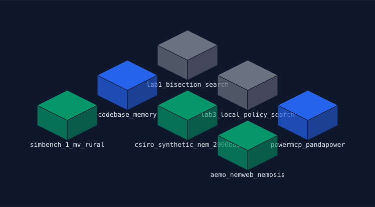
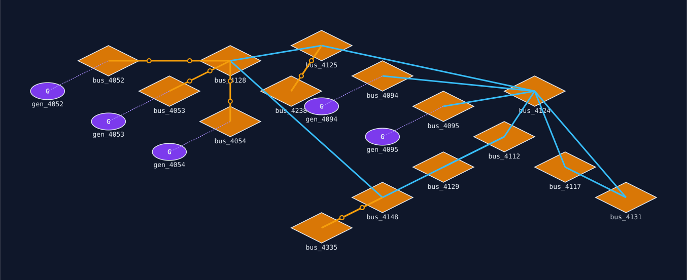
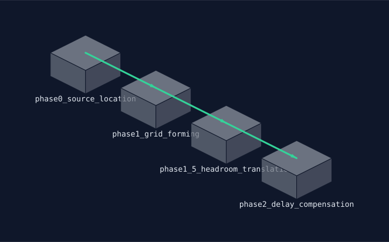

# Lab 6 — SysML v2 Digital-Thread MVP

> Status: **implemented** (all three tracks). Full scope, decisions, and the tool-evaluation
> findings below live in
> [`docs/prd/0006-sysml-digital-thread-mvp.md`](../../docs/prd/0006-sysml-digital-thread-mvp.md).
> This README is the lab-local summary and build notes.

*New to MBSE, SysML, or digital threads? See [Concepts for this lab](#concepts-for-this-lab) below.*

## See it run


A narrated replay of `just check-lab6` — one schema edit driving all three tracks end to end, no
manual steps. Higher-quality version: [tour.mp4](tour.mp4). Regenerate it yourself:
`just tour::tour 6` (live, unrecorded) or `just tour::tour-record 6` (re-record + re-render).

## What you'll do

This lab is a tooling **evaluation**, not just a demo: does SysML v2 (a systems-modelling language)
generalize across genuinely different jobs — modelling an AI agent/MCP/data workflow, modelling a
piece of grid network topology, and visualizing a real multi-phase implementation pipeline? One
schema, edited by hand, flows through one pipeline to regenerated artifacts — text, a diagram, and
(for one of the tracks) a software bill of materials — with no manual step in between:

```
LinkML instance data  -->  .sysml text  -->  syntax check  -->  isometric diagram (SVG)
                                                              -->  SBOM (Track A only)
```

Three tracks share the exact same generator/validator/renderer code, selected with `--track`:

- **Track A — digital thread**: this repo's own real `Agent`/`MCPServer`/`DataSource` inventory —
  Lab 1's bisection search, Lab 3's provider bake-off, the `powermcp-pandapower` pod, the CSIRO/AEMO/
  SimBench data sources every other lab already reads.
- **Track B — grid topology**: a real `Bus`/`Generator`/`Line` cluster pulled directly from
  `data/snemSA.m` (the same CSIRO case Lab 1 loads) — proving or disproving the same pipeline on an
  actual power-systems model, not just software components.
- **Track C — pipeline phases**: PRD-0005's own real, already-implemented Phase 0/1/1.5/2 sequence
  (Lab 5's grid-forming-stabilizer sprint) — the same "visualize a real pipeline as it runs" job the
  `ledgrrr` codebase's own Kasuari-backed layout solver is used for, reused here as a third proof
  the pipeline generalizes, this time to an ordered sequence rather than a topology graph.

## Why this matters

Every other lab in this repo models grid physics. This one asks a different question: can a formal
systems-modelling notation (SysML v2) usefully describe *this repo itself* — its agents, its data
flows, its infrastructure, its own implementation pipelines — and does that same notation also hold
up for describing a piece of the grid it studies? The answer for all three, and *why*, is the point
of this sprint.

## Concepts for this lab

- **MBSE (Model-Based Systems Engineering)** — instead of describing a system in prose documents,
  you build a formal model of its parts and how they relate, and derive diagrams/reports/checks from
  that one model rather than keeping them in sync by hand.
- **SysML v2** — the current (from 2025) version of a systems-modelling language, built on a
  smaller foundational language called KerML. This lab uses only its most basic building block: a
  `part def` (a *type* of thing, like a class) and a `part` (one *instance* of that type, like an
  object) nested inside a containing part — no ports, no signal-flow connections, no behavior
  diagrams. "Straight boxes are enough" for this MVP.
- **Digital thread** — a live, traceable link from a system's real components (code, data, infra)
  through to its model and documentation, so the model doesn't silently drift out of date. Track A's
  point: every entry traces to a real file already in this repo (see
  `schema/digital_thread_instances.yaml`'s `source` fields).
- **LinkML** (linkml.io) — a schema definition language (itself YAML) for describing structured
  data classes and validating instance data against them. Used here as the input schema this lab's
  `.sysml` text is *generated from* — LinkML is explicitly provisional (see the PRD's open
  questions), not treated as a permanent dependency.
- **Isometric diagram** — a 2D drawing that mimics a 3D angled view using flat-color polygons (no
  real 3D engine), the classic "SimCity"-style projection. Nodes here render as 3-face boxes at a
  fixed grid position, colour-coded by type.
- **CycloneDX / SBOM** — a standard JSON format for a software bill of materials: what components
  make up a system, and their provenance. Used here (Track A only) to show the digital-thread model
  can also emit a real, standard downstream artifact, not just a diagram.

## Design notes

Most of this pipeline is straightforward generated code; the syntax gate is the one place this
sprint deliberately went and tried the **real** external tool first — that write-up is part of the
knowledge this sprint set out to buy.

### 1. Syntax gate: the real SysML v2 Pilot Implementation (`validate_sysml.py`)

Two real paths to the normative SysML v2 parser were tried and timeboxed out on 2026-08-18:

1. **`gorenje/sysmlv2-jupyter-docker`** — a real, working community container, but it builds
   `Systems-Modeling/SysML-v2-API-Services` via SBT/Scala/Play against a PostgreSQL backend, pinned
   to release `2023-02` (three years stale against this repo's clock), and needs a 3-container
   compose stack (API + Postgres + Jupyter) for what this gate only needs as a single CLI check.
2. The official **`Systems-Modeling/SysML-v2-Pilot-Implementation`** repo's `README.adoc` only
   documents an Eclipse Modeling Tools IDE install — but its own `.github/workflows/build.yml` proves
   a real headless path exists: `./mvnw -B clean verify --file pom.xml` on JDK 21, no IDE. This
   host's system Java is 17; a `ghcr.io/graalvm/graalvm-community:21` podman container (confirmed
   `java -version` clean) removes that blocker with zero build changes. Scoping the Tycho reactor to
   just `org.omg.sysml.interactive` (`-pl org.omg.sysml.interactive -am`, skipping the
   `.editor`/`.edit`/`.plantuml`/`.jupyter.*` UI-only modules) got real progress — pom parsing,
   plugin resolution, and the reactor's first module build all ran cleanly. It then failed on a
   different, more specific problem: `com.sensmetry:sysand-maven-plugin:0.1.0-rc.1`'s `build-kpar`
   goal throws `UnsatisfiedLinkError: Native library resource not found2: linux-x86_64/sysand.so` —
   confirmed **not** an architecture mismatch (`uname -m` is `x86_64` on both host and container).
   This is a packaging bug in a pre-1.0 (`-rc.1`) native-JNI Maven plugin from Sensmetry (the same
   company behind Syside) that the official build's own bootstrap step depends on — a genuine
   third-party defect, not an environment mismatch on our end. Worth revisiting once
   `sysand-maven-plugin` ships a fixed release.

Neither path is "one dependency, ships in a day" territory today. `validate_sysml.py` is instead a
small, **named** structural stand-in: it checks exactly the grammar subset `generate_sysml.py`
actually emits (`package`/`part def`/`part`/`attribute`, line by line), reporting a real line/column
error on the first line that doesn't match an allowed shape, or on unbalanced braces. It is not a
general SysML v2 parser and doesn't claim to be — a future phase revisiting either real path above
would replace this one function, not the rest of the pipeline.

### 2. Diagram renderer: an in-repo isometric SVG writer (`translate_iso_ir.py`, `render_diagram.py`)

`translate_iso_ir.py` emits a small iso-IR JSON (`title`/`type`/`nodes[].{id,label,type,
position:{x,y}}`/`edges[]`), and `render_diagram.py` renders it with a pure, deterministic,
in-repo isometric-projection SVG writer — no browser, no DOM, no external renderer. That also
trivially satisfies this MVP's own "re-run on unchanged input → byte-identical SVG" kill check:
there's no font-shaping engine or animation frame to introduce variance, only fixed arithmetic on
the iso-IR JSON's own node positions.

### 3. Everything else: real, not simulated

`build_k8s_fixture.py` reads this repo's own real `kube/*.yaml` Pod/Job manifests (not a live
cluster call) — every field traces to a manifest already proven elsewhere in this repo with `podman
kube play`. `build_grid_instances.py` reads Track B's real cluster directly out of
`data/snemSA.m` via a deterministic `networkx` breadth-first walk from a real generator bus (127.3 MW,
bus 1683), preferring transmission-line neighbours over transformer neighbours at each frontier step
— a documented, re-runnable selection algorithm, not a one-time hand transcription (`schema/
grid_instances.yaml` is this script's own committed output; `--step check` re-derives it from the case
file and diffs, exactly like `build_k8s_fixture.py` does for Track A). It honestly reports a real data
quirk rather than smoothing it over: both transformer branches carry `sn_mva: 10000` in the source
case, two orders of magnitude above a real generator step-up transformer's typical rating — a
synthetic-case artifact, named as such in the generated file's own header. `generate_sbom.py` uses the
real `cyclonedx-python-lib` (Apache-2.0), not a hand-built dict, for Track A's CycloneDX-shaped SBOM.

### 4. The pipeline chains live, not through stale fixtures

An earlier version of `translate_iso_ir.py`/`render_diagram.py` read their input from the *committed*
`fixtures/expected_*.sysml`/`expected_*_iso_ir.json` snapshots rather than the previous stage's fresh
output — meaning editing a schema file only ever regenerated the first artifact in the chain
(`.sysml` text); the iso-IR JSON and SVG silently stayed frozen to whatever was last committed. Fixed
by chaining each stage as a direct in-process function call instead of a file read
(`translate_iso_ir.build_iso_ir()` now calls `generate_sysml.generate()` directly;
`render_diagram.generate()` now calls `translate_iso_ir.build_iso_ir()` directly) — `fixtures/` is used
only as the `--step check` comparison target now, never as a `--step run` input. Verified live: adding
a throwaway bus to `schema/grid_instances.yaml` and re-running the chain produced an 8-node SVG with
no other edits, then reverting made both stages report `MATCH` against the committed fixtures again.

The isometric renderer also went through a real second pass after first looking at its own output:
Track B's boxes-with-dashed-lines rendering technically had all 4 real branches present, but two were
visually indistinguishable from the node fills and generators had no edge to their own bus at all (a
missing-data bug, not just a style problem — `Generator.bus` was parsed but never turned into an
edge). `render_diagram.py` now dispatches on a per-node `shape` (`translate_iso_ir.py`'s
`SHAPE_BY_TYPE`): grid buses render as a flat bar (the real single-line-diagram bus convention),
generators as a "G"-labelled circle, and branches draw *after* nodes with real styling — solid bright
cyan for transmission, amber with a double-circle winding glyph for transformers, a thin dotted stub
for a generator's attachment to its bus. Track A (Agent/MCPServer/DataSource, no bus/branch concept)
keeps the original isometric box unchanged.

### 5. Node layout: a real Cassowary constraint solver, not a fixed grid

Track B's node positions were a fixed 3-per-row grid keyed only on array index
(`translate_iso_ir.py`'s old `_grid_positions`) — no relationship to the real `attachment`/
`branch` edges parsed above it, so a generator could land visually far from the bus it's actually
wired to, producing long diagonal edges that crossed through unrelated boxes. Pointed at a real
reference implementation to fix this properly rather than hand-placing coordinates: the `ledgrrr`
codebase's own diagram-layout solver
(`ledger-core/src/visualize.rs::layout::LayoutSolver`) uses the Rust `kasuari` crate (`kasuari =
"0.4"` in its `Cargo.toml`) — a real implementation of the **Cassowary constraint-solving
algorithm** (the same algorithm behind Apple Auto Layout and matplotlib's own layout engine),
exposing `Variable`/`Constraint`/`Strength`/`Solver` primitives: hard (`REQUIRED`) constraints
for non-negotiable ordering, soft (`WEAK`/`STRONG`) constraints for preferences that yield if a
`REQUIRED` constraint would otherwise be violated.

`translate_iso_ir.py`'s new `_cassowary_positions` mirrors that reference pattern directly, using
`kiwisolver` — the Python package already installed transitively via `matplotlib` (confirmed:
`import kiwisolver` works out of the box), implementing the identical Cassowary algorithm with the
same `Solver`/`Variable`/`Strength` shape, promoted to a direct dependency in `pyproject.toml` once
this module started importing it (license recorded in `docs/PSCADOSSE.md`: BSD-3-Clause).

**First version put every bus on one shared row** (`REQUIRED` gaps in `build_grid_instances.py`'s
own BFS discovery order), which fixed the original generator-placement problem but created a new
one, found by actually looking at the render, not assumed fine because the constraint math checked
out: Track B's real hub (`bus_4128`, four real branches — two transmission, two transformer
step-ups) got squashed onto a straight line regardless, since a single row only gives each bus two
array-adjacent neighbours' worth of straight-line room. Its two non-adjacent branches had to
"skip" over the buses between them, landing directly on top of the transmission backbone and
hiding it.

**Root-caused, not patched over**: the network *is* a star centred on `bus_4128` — one hub, four
leaves — and a single row can't represent that shape no matter how the edges are drawn. Fixed by
rooting the layout in the real branch graph instead of array order (`_anchor_forest`,
`_level_x_positions`): a fresh BFS over the real Bus-to-Bus `branch` edges finds the actual
highest-degree hub (tie-broken by id, not an arbitrary pick) and assigns each bus a row equal to
its real BFS depth from that hub, so a branch only ever connects adjacent rows. Each depth level's
x positions are solved independently with the same Cassowary primitives — `REQUIRED` sibling gaps
so children never overlap, plus a `REQUIRED` centroid constraint (`sum(children) == n * parent_x`,
real linear arithmetic, not a hand-picked spread formula) that centres each parent's children
symmetrically underneath it; cousin subtrees at the same depth get their own `REQUIRED` gap so
unrelated branches stay apart too. Confirmed by hand: the real 4-child hub solves to exactly
`[-3, -1, 1, 3]` around its parent at `0`. Every other node (currently only Generators) is still
`STRONG`-ly pulled to the same x as the bus its own `attachment` edge points to, one row below
whichever row the graph put that bus on.

Confirmed deterministic throughout (not physics/force-directed): re-running the solve against
Track B's real cluster produces bit-identical output every time, which is what keeps this
pipeline's byte-identical re-run kill check true. `render_diagram.py`'s bow-arc logic
(`_edge_skips_node`/`_quad_point`, added for the single-row version to keep a skipping edge from
hiding the backbone underneath it) stays in place as a real defensive fallback — this layout's
current real dataset never triggers it (every branch now connects adjacent rows), but it stays
correct if a future cluster's graph shape ever produces a same-row skip again.

### 6. Track A parity: it had zero edges, same gap class as Track B's earlier one

Asked directly ("what else can this visualize?"): Track A's Agent/MCPServer/DataSource nodes
rendered as pure, disconnected boxes — no edge at all, even though real relationships exist. This
is the exact same gap class Track B had before its own `attachment` fix (§2/§4 above), just not
yet noticed because Track A's boxes never had an obviously-missing line to spot the way Track B's
floating generators did.

**Checked what's real before inventing anything**: grepped `labs/01-simple-loadflow-fit/run.py`
and `labs/03-advanced-provider-bakeoff/orchestrator.py` for what data/MCP calls they actually
make. Both call `_shared.gridfit.load_case()` against a real CSIRO case file (`snemSA.m` /
`snem1803.m`, both fetched by the same `scripts/fetch_csiro_nem_data.py` — the
`csiro_synthetic_nem_2000bus` DataSource) — a real, verifiable `Agent uses DataSource` edge for
both. Also checked whether either agent calls the real `powermcp_pandapower` MCP server, and
found a real, already-documented negative: `orchestrator.py`'s own module docstring says the
`podman kube play --replace` swap for a live pod "genuinely works... but this script was not
rewired to call it" — both agents import `pandapower` in-process instead. So Track A's real graph
currently has zero `Agent`-to-`MCPServer` edges; reported as a finding, not invented to make the
diagram busier.

Added a `uses` slot to the `Agent` class (`schema/digital_thread.linkml.yaml`), populated from
that grep, not from role/description guesswork. `translate_iso_ir.py`'s attachment-edge detection
was already special-cased to `Generator.bus`; generalized to a `REFERENCE_ATTR_RE` dict keyed by
attribute name (`bus`, `uses`) so both tracks share one mechanism instead of per-type code.

**The layout itself needed generalizing, not just new edges.** The Cassowary layout's `Bus`/
`Generator` type checks were a Track-B-specific narrowing of a more general shape: any node that
is *not* the source of an `attachment` edge is structurally an **anchor** (laid out by the real
`branch`-edge graph); any node that *is* one is a **leaf** (pulled onto its anchor's x, one row
below). Track A has no `branch` edges at all — every DataSource/MCPServer is its own disconnected
one-node component — which `_anchor_forest` already handled correctly with zero new code, since a
component-of-one is just a tree with no children; the existing depth-0 root-separation rule
(`_level_x_positions`) spreads Track A's five disconnected anchors apart instead of collapsing
them onto one point.

One more real bug this surfaced, found by looking at the actual render, not assumed fine because
the constraint math was correct: two Agents attaching to the *same* DataSource both solved to the
exact same x (`STRONG == anchor_x` applied independently to each leaf has no reason to pick
different points) — invisible in Track B, where every real Generator attaches to a different Bus,
so it never came up until Track A had two Agents sharing one DataSource. Fixed by grouping leaves
by their shared target and applying the same sibling-gap-plus-centroid technique anchors already
use, so `lab1_bisection_search`/`lab3_local_policy_search` now solve to `x=3`/`x=5`, symmetric
around `csiro_synthetic_nem_2000bus` at `x=4`, instead of stacking on top of each other.

### 7. Stress-tested against a denser real cluster — found a real naming bug

Asked directly: does the layout hold up against a bigger, denser real topology, not just the
original 5-bus star? `build_grid_instances.py`'s `TARGET_CLUSTER_SIZE` bumped from 5 to 15 (same
anchor bus, same BFS walk, just walked further) reaches several real multi-degree substations —
bus 1740 (`bus_4128`), degree 11; bus 1728 (`bus_4124`), degree 9 — genuinely different from the
single-hub case the layout was designed against. Rendered result: multiple real hubs radiate
correctly, each with its own symmetric fan-out, still fully deterministic (confirmed: two runs,
bit-identical iso-IR). The one place it gets visually busy is around `bus_4124`, where several real
transmission lines cross each other — that's a genuine graph cycle in the real network (redundant
loop connectivity a tree/forest layout can't fully untangle), not an edge hiding another the way
the original single-row bug did; minimising crossings for a general graph with cycles is a much
larger, well-known hard graph-drawing problem, correctly out of this MVP's scope.

**Real bug this surfaced, not a cosmetic one**: this larger cluster genuinely contains parallel
branches — two real transformers between `bus_4125`/`bus_4238`, two more between `bus_4148`/
`bus_4335`, and two real parallel lines between `bus_4112`/`bus_4129` (confirmed against
`net.trafo`/`net.line` directly: real, distinct rows, not a selection-walk artifact). Naming every
branch from just its endpoint bus pair collapsed each of those three pairs onto one duplicate
name — invisible at the original 5-bus size purely because that cluster never happened to include
a parallel pair, not because the naming was actually unique. Fixed with `_dedupe_names()`: the
first branch on a bus pair keeps its plain name, subsequent ones get a `_2`/`_3` suffix, applied in
the same real table row order everything else here is read in. Also fixed in the same pass: the
header's "{names} both carry ..." phrasing silently became grammatically wrong once a quirk applied
to more than two transformers, and the "real quirk" paragraph naming which bus pairs have parallel
branches was hardcoded prose from the original 2-transformer case — both are now derived from the
actual generated data (`_parallel_branch_note`), so they stay correct if the anchor or cluster size
changes again.

### 8. Track C: a third, genuinely different business case, not just more instance data

Asked directly: what else can this pipeline visualize? Options considered: a bigger Track B cluster
(§7, done), Track A's own missing edges (§6, done), and a genuinely different job — visualizing a
real *pipeline* as it runs, the exact use case that sent this whole Cassowary investigation to the
`ledgrrr` codebase in the first place (`ledger-core/src/visualize.rs`'s own module doc: "Kasuari
provides layout constraints for positioning" a Mermaid `stateDiagram-v2` of pipeline states). Track C
is that third case, grounded in PRD-0005's own real, already-implemented Phase 0/1/1.5/2 sequence
(Lab 5's grid-forming-stabilizer sprint) — every `source`/`role` in `schema/
pipeline_phases_instances.yaml` is read from that phase's own script docstring or PRD-0005's own
"## Phasing"/"Open questions" sections, not paraphrased from memory; Phase 3 onward are deliberately
excluded since PRD-0005 itself marks them "not started"/"aspirational."

**A chain needed its own layout, not a variant of the hub/star one.** Track C's one relationship
(`Phase.next`) is a real *declared order* — step 1, then 2, then 3 — not an undirected graph
relationship the way Track B's `branch` edges are. Routing it through `_cassowary_positions`'s
anchor/leaf split (rooting at the highest-*degree* node) would have ignored that order and centred
the diagram on whichever interior phase happens to have two neighbours, misrepresenting a real
ordered sequence as an undirected star. So Track C introduces a `sequence` edge type (parsed the
same generic way `bus`/`uses` already are — `REFERENCE_ATTR_RE`/`EDGE_TYPE_BY_REFERENCE_ATTR`, one
more line each, no new parsing mechanism) and its own `_sequence_positions`, which is the most
direct port yet of the actual reference pattern this design was pointed at:
`ledger-core/src/visualize.rs::layout::LayoutSolver::generate_layout`'s own REQUIRED consecutive
`x_i + gap <= x_(i+1)` constraints walking a fixed order, plus a WEAK STAY pinning the first
element — applied here to the schema's own real declared `next` chain instead of a hardcoded state
list. `_iso_positions` now picks one of three layouts by real edge shape: `sequence` edges mean a
declared order; any other edges mean an undirected hub/star; no edges means the plain grid.

Since a `sequence` edge is the first genuinely *directed* relationship this renderer draws
(`attachment`/`branch` read as undirected ownership/topology links), a same-styled undirected line
wouldn't show which way a phase actually flows into the next — `render_diagram.py` gained a real
arrowhead (`_arrowhead`, a small filled triangle oriented along the edge's real direction), not just
a new stroke colour. Confirmed deterministic and non-regressing the same way every prior track was:
two runs bit-identical, Track A/B's own fixtures untouched.

## Command

```
uv run labs/06-sysml-digital-thread/build_k8s_fixture.py --step check
uv run labs/06-sysml-digital-thread/build_grid_instances.py --step check

uv run labs/06-sysml-digital-thread/generate_sysml.py --track digital-thread --step run
uv run labs/06-sysml-digital-thread/generate_sysml.py --track grid --step run
uv run labs/06-sysml-digital-thread/generate_sysml.py --track pipeline --step run
uv run labs/06-sysml-digital-thread/generate_sysml.py --track digital-thread --step check
uv run labs/06-sysml-digital-thread/generate_sysml.py --track grid --step check
uv run labs/06-sysml-digital-thread/generate_sysml.py --track pipeline --step check

uv run labs/06-sysml-digital-thread/validate_sysml.py --step check

uv run labs/06-sysml-digital-thread/translate_iso_ir.py --track digital-thread --step run
uv run labs/06-sysml-digital-thread/translate_iso_ir.py --track grid --step run
uv run labs/06-sysml-digital-thread/translate_iso_ir.py --track pipeline --step run

uv run labs/06-sysml-digital-thread/render_diagram.py --track digital-thread --step run
uv run labs/06-sysml-digital-thread/render_diagram.py --track grid --step run
uv run labs/06-sysml-digital-thread/render_diagram.py --track pipeline --step run

uv run labs/06-sysml-digital-thread/generate_sbom.py --step run

uv run python -m pytest labs/06-sysml-digital-thread/test_lab6.py -v
```

Or, all of the above chained in one command: `./scripts/demo_lab6.sh` (also `just lab6-demo`).

To see the live "edit one schema, watch it propagate" demo: add one `Agent`/`MCPServer`/`DataSource`
entry to `schema/digital_thread_instances.yaml`, one `Bus` to `schema/grid_instances.yaml`, or one
`Phase` to `schema/pipeline_phases_instances.yaml`, then re-run `./scripts/demo_lab6.sh` — the new
part appears in the regenerated `.sysml` text, diagram, and (Track A) SBOM with no other hand edits.

## Running in a container

```
podman build -t nem-poweragent-base:local -f Containerfile.base .
podman build -t lab6:local -f labs/06-sysml-digital-thread/Containerfile .
podman run --rm lab6:local
```

(Swap `podman` for `docker` if that's what you have.) The default run chains the same steps
`scripts/demo_lab6.sh` runs natively — well under a minute.

## Step-by-step walkthrough

1. **`build_k8s_fixture.py --step check`** — confirms `fixtures/k8s_snapshot.json` still matches a
   fresh reshape of this repo's real `kube/*.yaml` manifests. Output: `MATCH: 4 pod items vs
   k8s_snapshot.json`.
2. **`build_grid_instances.py --step check`** — confirms `schema/grid_instances.yaml` still matches a
   fresh BFS re-derivation from the real `data/snemSA.m` case. Output: `MATCH: grid_instances.yaml vs
   a fresh re-derivation from data/snemSA.m`.
3. **`generate_sysml.py --track {digital-thread,grid,pipeline} --step run`** — reads each track's
   LinkML instance YAML, writes `output/digital_thread.sysml` / `output/grid_topology.sysml` /
   `output/pipeline_phases.sysml`. `--step check` confirms byte-identical against the committed
   `fixtures/expected_*.sysml`.
4. **`validate_sysml.py --step check`** — runs the named structural syntax gate (see Design notes
   above) against all three committed fixtures. Output: `OK: ... -- 69 lines, structurally clean` /
   `275 lines` / `35 lines`. A deliberately broken `.sysml` file fails with a real
   `path:line:col: message` — see `test_lab6.py::test_syntax_gate_rejects_broken_input`.
5. **`translate_iso_ir.py --track {digital-thread,grid,pipeline} --step run`** — chains directly off
   `generate_sysml.generate(track)` (an in-process call, not a fixture read — see Design notes) and
   walks the resulting `.sysml` part usages into iso-IR JSON (Track A: 7 nodes/2 edges — both real
   Agent-to-DataSource `attachment` edges, see Design notes §6; Track B: 20 nodes/24 edges — 12
   transmission, 7 transformer, 5 generator-to-bus attachments, at the real 15-bus cluster size
   Design notes §5 stress-tests the layout against; Track C: 4 nodes/3 real `sequence` edges, PRD-0005's
   own Phase 0→1→1.5→2 order, see Design notes §8).
6. **`render_diagram.py --track {digital-thread,grid,pipeline} --step run`** — chains directly off
   `translate_iso_ir.build_iso_ir(track)` and renders a deterministic isometric SVG
   (`output/digital_thread.svg` / `output/grid_topology.svg` / `output/pipeline_phases.svg`) —
   Track B as a real bus/branch diagram (bars, generator circles, styled edges), Track C as a real
   directed sequence (arrowheads), Track A as the original isometric boxes, all now with real edges
   drawn between them.
7. **`generate_sbom.py --step run`** — Track A only: writes `output/digital_thread_sbom.json`, a real
   CycloneDX v1.5-shaped document, 7 components.

Full chain, timed: `./scripts/demo_lab6.sh` runs in well under a second on this host — comfortably
inside a 2-minute walkthrough budget.

## Diagrams (`fixtures/expected_*.svg`, the committed reference renders)

Track A — digital thread (isometric boxes, `Agent`→`DataSource` attachment edges):



Track B — grid topology (real bus/branch single-line rendering, Cassowary-solved layout):



Track C — pipeline phases (a real directed sequence, arrowheads showing phase order):



## Files

- `schema/digital_thread.linkml.yaml`, `schema/grid_topology.linkml.yaml`,
  `schema/pipeline_phases.linkml.yaml` — the three LinkML schemas (Track A: `Agent`/`MCPServer`/
  `DataSource`; Track B: `Bus`/`Generator`/`Line`; Track C: `Phase`), each with a `tree_root: true`
  container class.
- `schema/digital_thread_instances.yaml` — Track A's real seed instance data (see Design notes above
  for provenance); hand-curated, since Agent/MCPServer/DataSource have no single upstream "case file"
  to derive from the way Track B's grid data does.
- `schema/grid_instances.yaml` — Track B's real seed instance data; **generated**, not hand-authored
  — see `build_grid_instances.py` below.
- `schema/pipeline_phases_instances.yaml` — Track C's real seed instance data; hand-curated from
  PRD-0005's own Phasing section and each phase script's own docstring (see Design notes §8).
- `build_k8s_fixture.py` — real `kube/*.yaml` manifests → `fixtures/k8s_snapshot.json` (Track A's own
  input fixture).
- `build_grid_instances.py` — real `data/snemSA.m` → `schema/grid_instances.yaml` (Track B's own input
  fixture), via a deterministic BFS graph walk (`--step run`/`check`; see Design notes above).
- `generate_sysml.py` — LinkML instance data → `.sysml` text, all three tracks (`--track`, `--step
  run`/`check`).
- `validate_sysml.py` — the named structural syntax gate (`--step check` only; see Design notes).
- `translate_iso_ir.py` — `.sysml` parts/containment → iso-IR JSON, all three tracks.
- `render_diagram.py` — iso-IR JSON → deterministic isometric SVG, all three tracks.
- `generate_sbom.py` — Track A only: real CycloneDX-shaped SBOM via `cyclonedx-python-lib`.
- `fixtures/` — every committed fixture: `expected_*.sysml`, `expected_*_iso_ir.json`,
  `expected_*.svg`, `expected_sbom.json`, `k8s_snapshot.json`.
- `test_lab6.py` — pytest wrapper, subprocess-driven `--step check` gates per script/track (matching
  `labs/02-.../test_lab2.py`'s pattern).
- `Containerfile` — `FROM nem-poweragent-base:local`, chains `scripts/demo_lab6.sh`.
