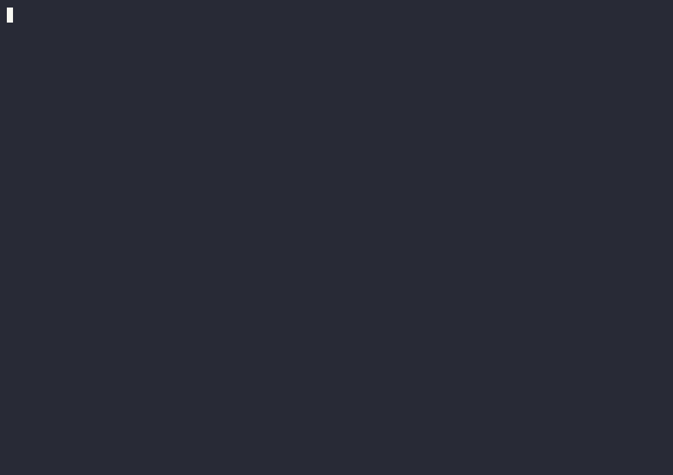

# Lab 7 — Rust FFT/COMTRADE Detector: a Generate/Detect Testbench

Every detector in this repo so far runs in Python, in the same process that generated the signal.
This lab asks a narrower, harder question: if the *same* telemetry left the process — written to
disk in the real file format power-system relays and disturbance fault recorders (DFRs) actually
emit (COMTRADE, IEEE C37.111) — could an independent Rust program, using a real FFT library, read
it back and recover the same oscillation-mode finding? It's a testbench, not a hardware
integration: the point is proving the generate (Python)/detect (Rust) round trip works end to end,
via the real interchange format, before any real relay or DFR is ever in the loop.

## See it run



A narrated replay of `just check-lab7` — a real COMTRADE file, read back and re-detected by an
independent Rust FFT pipeline. Higher-quality version: [tour.mp4](tour.mp4). Regenerate it yourself:
`just tour::tour 7` (live, unrecorded) or `just tour::tour-record 7` (re-record + re-render).

## What you'll do

- Regenerate (optional — the results are already committed) two real COMTRADE fixtures from the
  already-calibrated Iberian 2025 precursor scenario
  (`labs/05-spartan-chaosnet-transient-stream/scenarios/iberian_2025_blackout.py`'s
  `run_precursor()`): a 20 s slice around its 0.63 Hz local mode and a 25 s slice around its 0.2 Hz
  inter-area mode.
- Run the Rust `fft-detector` binary against each fixture and confirm it recovers the same
  oscillation frequency and confidence Python's own `OscillationDetector.consume()` computed on the
  identical in-memory waveform, just read back through the COMTRADE file instead.

## The actual result

Both fixtures match. The Rust binary, reading nothing but the `.cfg`/`.dat` pair, recovers:

| Fixture | Python reference | Rust recovered | 
|---|---|---|
| `local_mode` | mode_hz=0.65033 confidence=0.3361 | mode_hz=0.65033 confidence=0.3361 |
| `inter_area_mode` | mode_hz=0.20008 confidence=0.3829 | mode_hz=0.20008 confidence=0.3829 |

`cargo test --manifest-path rust/Cargo.toml -p fft-detector` asserts this directly
(`tests/comtrade_fixture.rs`); `just check-lab7` runs the same check via the CLI's `--check` mode.

## Design notes

- **COMTRADE, not a custom format** — chosen explicitly because it's what a real relay/DFR would
  emit; an internal JSON/CSV format would prove nothing about hardware readiness.
- **`rust/fft-detector/src/comtrade.rs` is a from-spec ASCII/1999-revision reader**, not a literal
  fork of the only Rust COMTRADE crate that exists (`drewsilcock/comtrade`, crates.io `comtrade`
  v0.2.2) — that crate is unmaintained since 2022 and self-described "WIP, not production ready,"
  and pulls in `derive_builder`/`regex`/`lazy_static`/`byteorder` for binary16/32/float32/2013-
  timezone paths this project's own writer never emits. This module keeps that crate's field
  semantics (multiplier/offset scaling, primary/secondary factors, skew) but is scoped to the one
  path (ASCII, revision "1999") that can actually be round-trip-tested against real fixtures;
  binary formats are rejected with a clear error rather than silently mishandled.
- **`labs/_shared/scenario_engine/comtrade_writer.py` is hand-written**, not a dependency, because
  no PyPI package writes COMTRADE (`comtrade`/`python-comtrade` is read-only) and the one real
  GitHub writer found (`comtradehandlers`) is unmaintained and unpublished — the ASCII format is
  small enough (~60 lines) to write directly, cross-validated against two independent open-source
  implementations during this feature's research pass.
- **`realfft`/`rustfft`** (crates.io, live-verified reachable this session) do the actual FFT —
  `rust/fft-detector/src/detector.rs` is a field-for-field port of
  `labs/_shared/scenario_engine/detectors.py::OscillationDetector.consume()`, reusing
  `phase_model::ThreePhaseWaveform::phasor_frames()`/`positive_sequence()` unmodified rather than
  re-deriving the phasor extraction.
- **Fixtures are real slices, not synthetic sinusoids** — `generate_fixture.py` runs the actual
  precursor pandapower stepper (~40 s) and slices two real windows out of the one real waveform, so
  the Rust detector is proving itself against genuine signal-processing output, not a fabricated
  test tone (a synthetic-tone unit test also exists,
  `rust/fft-detector/src/detector.rs::tests::recovers_known_oscillation_frequency`, but that's a
  sanity check, not the proof this lab makes).
- **PyO3 (optional, `python` Cargo feature)** — exposes the detector as a Python extension module
  (`maturin build --features python`) for fast in-process calibration/testing. This is a developer
  convenience only; the primary, always-required interchange stays the COMTRADE file, for the same
  real-hardware-relevance reason named above.

## Command

```
uv run python labs/07-rust-comtrade-fft-detector/generate_fixture.py   # regenerate fixtures (~40s, optional)
cargo test --manifest-path rust/Cargo.toml -p fft-detector
just check-lab7
```

## Running in a container

```
podman build -t nem-poweragent-base:local -f Containerfile.base .
podman build -t lab7:local -f labs/07-rust-comtrade-fft-detector/Containerfile .
podman run --rm lab7:local
```

Unlike every other lab's Containerfile, this one installs a Rust toolchain on top of the shared
Python base image at build time — see the Containerfile's own header for why.

## Files

- `rust/fft-detector/` — the Rust crate (third member of the `rust/` Cargo workspace, alongside
  `phase-model`/`demo-app`): `src/comtrade.rs` (reader), `src/detector.rs` (FFT port),
  `src/python.rs` (optional PyO3 bindings), `src/main.rs` (CLI).
- `labs/_shared/scenario_engine/comtrade_writer.py` — the Python-side ASCII COMTRADE writer.
- `generate_fixture.py` — regenerates `fixtures/*.cfg`/`*.dat`/`*.expected.json`.
- `fixtures/` — committed COMTRADE fixtures + Python-computed expected findings.
