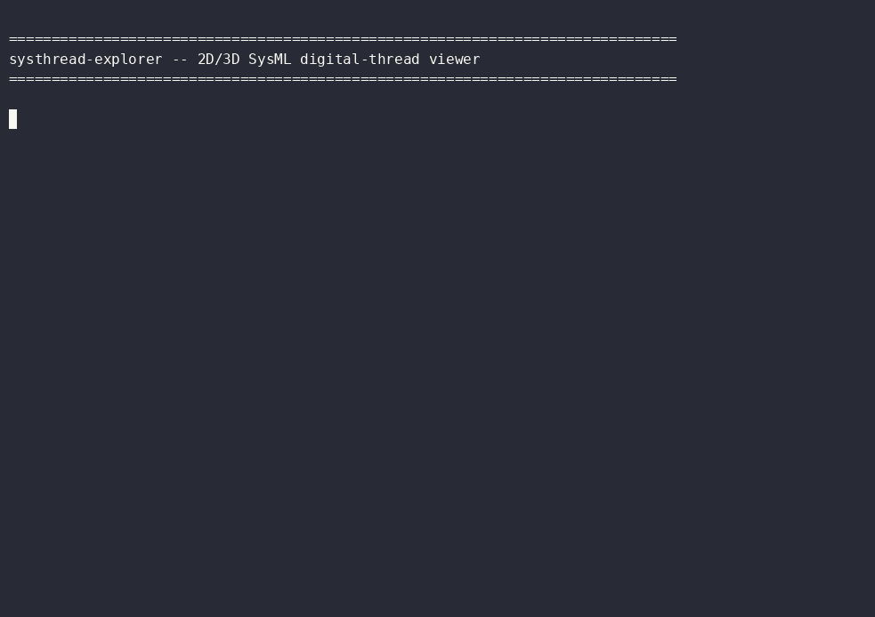

# systhread-explorer

The systhread model explorer: one generic Bevy viewer, compiled to `wasm32-unknown-unknown`, that
renders a project's SysML model as an interactive 3D (or flat 2D) graph.

Design: `docs/superpowers/specs/2026-08-26-systhread-3d-explorer-design.md`.
Plan: `docs/superpowers/plans/2026-08-26-systhread-3d-explorer-v1.md`.

## See it run



The recording covers the CLI pipeline (render with `--explorer` → bundle → serve); a terminal
can't capture the WebGL canvas itself, so see "Browser status" below for what that looks like.

## How the pieces fit

- `systhread render --track <track> <instances.yaml> --out <dir> --explorer` writes
  `<track>_explorer.json`, a `PositionedGraph`: the Cytoscape-shaped graph plus an
  ahead-of-time, deterministic layout. Byte-identical on unchanged input, like every other
  systhread artifact, and listed in the output directory's `manifest.json` as
  `kind: "positioned_graph_json"`.
- This crate is the viewer for that file. It is **one build, reused by every project** — the
  per-project part is the JSON, never a recompile.
- `loader` and `scene` are Bevy-free and compile for both native and wasm; `asset` and `app` are
  the ECS layer behind the `explorer-3d` feature.

## Commands

    just systhread-explorer-bundle                 # build dist/ (renders the grid track as demo data)
    just systhread-explorer-bundle path/to/x.json  # ...or bundle a specific PositionedGraph
    just systhread-explorer-serve                  # http://localhost:8765/
    just check-systhread-explorer                  # tests (default, Bevy-free features)
    just check-systhread-wasm                      # systhread-core's ouroboros gate
    just systhread-wasm-setup                      # one-time: wasm32 target + matching wasm-bindgen CLI

Controls: left-drag orbits, scroll wheel zooms. A 2D layout locks pitch and faces the plane head-on.

## Cargo features

- `explorer-3d` — the Bevy renderer. An explicit component list, never a Bevy meta-feature.
  (wasm target only — use `explorer-desktop` to build natively)
- `explorer-web` — `explorer-3d` plus WebGL2, for browsers without WebGPU.
- `explorer-desktop` — `explorer-3d` plus `bevy/x11`, for running the viewer natively on Linux.

**Bevy 0.19.1 packaging bugs this crate works around** (both real, both hit during development):
`bevy_animation 0.19.1` and `bevy_picking 0.19.1` were never published, so any feature path
reaching them fails to resolve. That rules out `ui`/`default_app`/`scene` *and* `bevy/webgl2`,
`bevy/webgpu`, `bevy/web` (which reach `bevy_dev_tools` → `bevy_picking`). `explorer-web`
therefore turns WebGL2 on by declaring `bevy_render`/`bevy_core_pipeline`/`bevy_pbr` directly.

## Browser status

The default `explorer-3d` build (wgpu's WebGPU backend) does **not** draw in a real browser: it
panics at startup with `wgpu::Instance::new` reporting "No wgpu backend feature that is
implemented for the target platform was enabled" — the WebGPU adapter path fails on this
machine's Chrome. This is exactly the fallback case the design anticipated, and the fallback is
the one that actually works:

```bash
SYSTHREAD_EXPLORER_FEATURES=explorer-web just systhread-explorer-bundle
```

**Verified in a real desktop Chrome** (`AdapterInfo { name: "ANGLE (Intel, Intel(R) HD Graphics
630 ...) Direct3D11 ...", backend: Gl, ... }`), served over a real LAN hostname
(`http://fung1.lan:8765/` — plain `localhost`/`127.0.0.1` were unreachable from that browser's
network context in this environment; that's an environment quirk, not an app issue):

1. **Console log line** — PASS. Printed exactly as expected:
   `systhread-explorer: 20 nodes, 24 edges, flat=false`.
2. **Spheres and connecting cylinders visible on the canvas** — PASS. Geometry matches the grid
   track's 15 buses + 5 generators + edges, correctly shaded in the intended cyan-blue
   `StandardMaterial` color. (Originally rendered magenta/unlit, traced to
   `TonyMcMapFace` tonemapping requiring the `tonemapping_luts` feature; fixed by setting an
   explicit `Tonemapping::None` on the camera in `app.rs` — no LUT asset needed, matches this
   viewer's flat/unlit-shading style — and re-verified in the same real browser.)
3. **Left-drag orbit / scroll-wheel zoom** — **not live-confirmed**, but **code-verified
   correct**. Multiple independent automated input methods (browser-extension drags, stepped
   incremental drags and scroll, and a separate Playwright script issuing real multi-step
   `mouse.move()` calls) all failed to move the camera — the scene was pixel-identical
   before/after every attempt. Root cause, confirmed by reading
   `winit-0.30.13/src/platform_impl/web/web_sys/event.rs:118-129` directly: winit's web backend
   derives Bevy's `MouseMotion` events strictly from the DOM's native `event.movementX`/
   `movementY` fields, which populate only on genuine relative mouse motion (real OS-level pointer
   movement or certain pointer-lock states) — synthetic/automated mouse events in this environment
   do not reliably populate them, so this control path is structurally unexercisable by the
   automation available here. This is **not** evidence of an app bug: Task 11's code review
   independently hand-verified the orbit math (`orbit_offset`/`orbit_from_scene` in `app.rs`) is
   an exact round-trip, and the input-wiring in `orbit_camera` (reads `MessageReader<MouseMotion>`
   / `MessageReader<MouseWheel>`, gates yaw/pitch on `buttons.pressed(MouseButton::Left)`) is
   correct by inspection. **Recommendation: a human should do a 5-second manual spot-check** of
   orbit/zoom before relying on this control in a demo — it has not been live-confirmed, only
   verified by code inspection.

## Native desktop (`explorer-desktop`)

Verified with a real (virtual-display) run, not just a compile check: `cargo build --features
explorer-desktop` under `xvfb-run`, forced onto Mesa's software Vulkan implementation
(`VK_ICD_FILENAMES=.../lvp_icd.json`, since this host's real GPU driver — NVK — panics with
`wgpu-hal invariant was violated: Requested feature is not available on this device`, a driver gap
unrelated to this crate). The binary opened a real X11 window, logged
`systhread-explorer: 20 nodes, 24 edges, flat=false`, and a captured screenshot (`xwd`/`convert`)
shows the grid track's nodes and edges actually drawn — cyan spheres, white cylinder edges, dark
background — confirming the native path renders real geometry, not only that it links.
